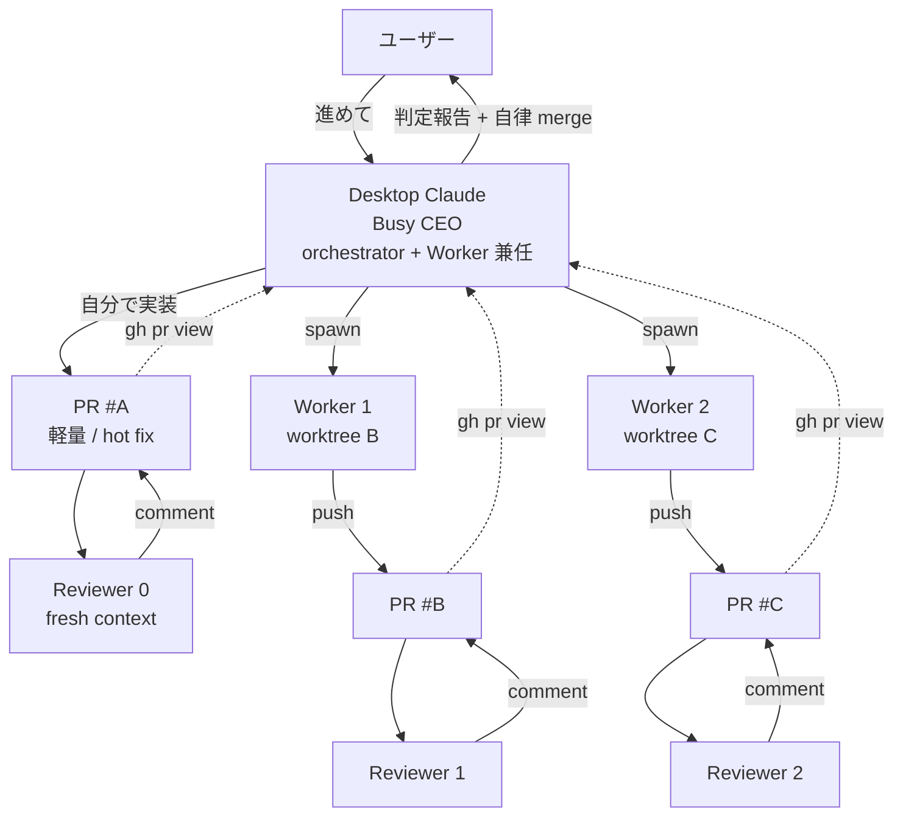

# キミテラス v2 開発ガードレール（Claude Code 用）

このプロジェクトは旧 [キミテラス](../キミテラス/)（Firebase 構成）から **GCP ネイティブ構成への全改修版**。
公立高校の生徒データを 10 年保管前提で扱うため、**動けばいい開発は許容しない**。

このファイルは **不変の規律と参照先のインデックス**。現在地は [docs/STATUS.md](docs/STATUS.md) を参照すること。

---

## 必読フロー: 新セッション開始時

1. このファイル（CLAUDE.md）を読む
2. [docs/STATUS.md](docs/STATUS.md) を読む（現在地・進行中タスク・詰まり）
3. 該当 issue / PR を読む
4. `git status && git log -5` で最新状態確認
5. 必要なら Plan agent で実装計画
6. 着手

新セッションが**5分以内に作業に入れる**ことを設計目標とする。

---

## Operating Mode（Desktop = Busy CEO）

Desktop Claude は **「超多忙な社長」モード** で動作する (2026-05-29 ユーザー判断、旧 Orchestrator-only 規律を統合)。
**orchestrator と Worker の両方を兼任**し、状況に応じて「自分で手を動かす」「部下 (sub-agent / spawn) に任せる」を判断する。

### 判断マトリクス（「進めて」と言われたら最初にこれを見る）

| 状況 | 推奨 |
|---|---|
| 1 ファイル数行〜数百行の修正、緊急 fix、設計判断と実装が一体 | **Desktop が直接** |
| Worker が hang・引継ぎが必要 | Desktop が直接で救済 |
| 複数の独立タスクを並列で進めたい | Worker / Agent spawn 並列 |
| 1000+ 行の新規実装、setup-heavy、Desktop context を温存したい | Worker spawn (worktree isolation) |
| **Reviewer 役** | **Agent spawn 必須**（self-review 制約 + 客観性） |
| 調査・探索で 3+ クエリ | Explore agent |

### Desktop が直接やってよいこと

- **Edit / Write でアプリケーションコード・運用 docs を編集**
  - 旧 NG だった `docs/requirements/`, `docs/adr/`, `docs/architecture/`, `docs/compliance/`, `packages/`, `apps/`, `infrastructure/` すべて含む
- **`git commit` / `git push` / PR 作成・更新**（main 直接 push もメタ規律ドキュメントなら OK、それ以外は branch + PR）
- **`pnpm install` / `npm install` / `pnpm test` / `pnpm build` 等の環境・検証コマンド**
- **PR の merge**（客観検証を経た上で、後述「自律的意思決定の範囲」内なら）
- **GitHub Issue 作成・更新**

### Desktop が依然やらないこと

- ❌ **Reviewer をスキップして自分の PR を merge** — 客観性のため Reviewer Agent spawn 必須（[[worker-review-discipline]] 維持）
  - 同一アカウント self-review 制約で `--approve` が通らない場合は `--comment` フォールバックで「APPROVE 相当」明記
- ❌ **CLAUDE.md 8 ルール違反**（監査カラム / RLS / 型単一ソース = Drizzle / PII マスキング / Secret Manager / 1 PR ≤500 行 / テスト緑 / Terraform 化）
- ❌ **客観検証を経ていない destructive actions**（force push to main、`git reset --hard` for shared branches、本番 DB drop、未検証の Terraform destroy 等）

### 自律的意思決定の範囲（ユーザー確認不要）

**Reviewer / CI / テスト等の客観検証を経た意思決定は、ユーザー許可を求めずに自律実行してよい**（2026-05-29 ユーザー判断）。具体的には:

| 状況 | アクション |
|---|---|
| CI 12/12 green + Reviewer APPROVE | **自律で `gh pr merge --squash --admin`** |
| CI green + Reviewer COMMENT (軽微) | 軽微指摘を自分で吸収できるなら修正コミット追加→再 CI→自律 merge |
| CI green + Reviewer REQUEST_CHANGES | 修正方針が明確なら自分で fix → 再 CI → 再 Reviewer → 自律 merge |
| CI 赤の原因が PR 由来 | 自分で fix → 再 push (自律) |
| Reviewer 指摘で関連 dormant bug 発覚 | PR scope に同梱して fix、または別 Issue/PR に切り出し (どちらも自律判断) |
| **破壊的変更で Reviewer + CI 経由済** | 自律 merge OK（旧「破壊的変更は確認必要」は廃止、検証経路があれば自律） |

### 依然ユーザー確認が必要なケース

- **客観検証を通っていない destructive action**: 本番 GCP リソース削除、Cloud SQL drop、Secret Manager rotation、Terraform destroy を CI なしで実行
- **スタック判断の根本反転**: ADR を覆す決定（ADR レビュー経由なら自律 OK）
- **ユーザーが明示的に「これは聞いて」と指定した範囲**
- **外部に視認される一方向アクション**: 公開済 PR への外部投稿、Slack/メール送信、本番デプロイ

### orchestrator pattern を使う時の構造図（並列度を稼ぐ場合）



### Context 経済性

「超多忙な社長」は会議だけして context を使い切るのも下手、全部自分でやって 1 件で context を吹き飛ばすのも下手。優先順:

1. **1-3 ターンで終わる小規模** → Desktop 直接（spawn overhead より速い）
2. **並列度 N で稼げる独立タスク** → Worker / Agent spawn 並列
3. **長時間ブロック可能性** → spawn して Desktop は別作業
4. **客観レビュー必須** → Reviewer Agent spawn
5. PR メタは `--json title,body,additions,deletions,statusCheckRollup` で取得
6. PR diff 全文は context に丸読みしない、file:line で参照
7. Worker / Reviewer の log は **異常時のみ** `tail -30` で確認

→ Desktop の context は 1 日中使ってもほぼ枯れないことが設計目標。

### 関連 memory

- [[busy-ceo-mode]] — 本セクションの一次ソース
- [[desktop-as-worker-authorized]] — busy CEO mode の前身（包含済）
- [[orchestrator-commit-push-authority]] — 旧範囲制限（包含済、メタ規律以外も Desktop 直接 OK に）
- [[pr-merge-authority]] — 自律 merge 権限（範囲拡張済）
- [[worker-review-discipline]] — Reviewer 必須は維持

---

## 必読フロー: セッション終了時

1. [docs/STATUS.md](docs/STATUS.md) を更新（次セッションが迷子にならないため）
2. 中途半端なコードもコミット（ローカルにだけ残さない）
3. 重要な技術判断は [docs/adr/](docs/adr/) に追加
4. 詰まりは STATUS.md の「詰まり / 確認待ち」に明示
5. プロジェクト横断の規律が出た場合は `~/.claude/projects/.../memory/` に追加

---

## スタック構成（不変）

| レイヤー | 採用技術 | 理由 → ADR |
|---|---|---|
| フロントエンド | Next.js 16 (SSR + Server Actions) | [ADR-008](docs/adr/008-nextjs-route-handlers.md) |
| デプロイ | Cloud Run (asia-northeast1) | [ADR-002](docs/adr/002-cloud-run-vs-functions.md) |
| 認証 | Identity Platform | [ADR-003](docs/adr/003-identity-platform.md) |
| データ | Cloud SQL for PostgreSQL 16 + pgvector | [ADR-001](docs/adr/001-postgres-vs-firestore.md) |
| ORM | Drizzle | [ADR-004](docs/adr/004-drizzle-vs-prisma.md) |
| AI | Vertex AI Gemini (asia-northeast1) | [ADR-005](docs/adr/005-vertex-ai.md) |
| AI ストリーミング | Vercel AI SDK | [ADR-006](docs/adr/006-vercel-ai-sdk.md) |
| ベクトル検索 | pgvector（PostgreSQL 内） | [ADR-007](docs/adr/007-pgvector.md) |
| IaC | Terraform | [ADR-009](docs/adr/009-terraform.md) |
| パッケージ管理 | pnpm + Turborepo | [ADR-010](docs/adr/010-pnpm-turborepo.md) |
| コード品質 | Biome（ESLint+Prettier 統合） | [ADR-011](docs/adr/011-biome.md) |
| テスト | Vitest + Playwright + DATABASE_URL env (実 PG) | [ADR-012](docs/adr/012-testing-stack.md) |
| API | Next.js Route Handlers（Hono 非採用） | [ADR-008](docs/adr/008-nextjs-route-handlers.md) |
| エラー追跡 | Sentry | [ADR-013](docs/adr/013-sentry.md) |
| 観測 | Cloud Logging + Cloud Trace + OpenTelemetry | [ADR-014](docs/adr/014-observability.md) |

スタック変更は **ADR を新規作成 + 既存 ADR を Superseded にする** 手続きが必要。勝手に変えない。

---

## ルール1: 全テーブルに監査カラムを必ず付ける

### 適用条件
新規テーブル定義時、または既存テーブルにフィールド追加時。

### やること
全テーブルに以下のカラムを **例外なく** 付ける:

```typescript
created_at: timestamp().notNull().defaultNow(),
updated_at: timestamp().notNull().defaultNow(),
created_by: uuid().references(() => users.id),  // nullable: システム作成は null
updated_by: uuid().references(() => users.id),
// 操作元 IP は audit_log テーブル側で記録
```

別途 `audit_log` テーブルで以下を記録:
- who: user_id, ip_address, user_agent
- what: table_name, record_id, operation (insert/update/delete), diff
- when: timestamp

### NG パターン
- 「ログテーブルだから監査不要」 → ログテーブルも改竄検知のため監査対象
- 「マスタテーブルだから更新者は不要」 → 学校マスタの不正書き換えは最も追跡したい

### 理由
公立校データの法定保存と漏洩時の影響範囲特定。監査ログがないと、漏洩時に「誰がどこまで見たか」を立証できない。

---

## ルール2: PostgreSQL の RLS を絶対に無効化しない

### 適用条件
すべての**テナント分離が必要なテーブル**（school_id を持つテーブル全部）。

### やること
1. テーブル作成時に必ず RLS を有効化:
   ```sql
   ALTER TABLE schedules ENABLE ROW LEVEL SECURITY;
   CREATE POLICY tenant_isolation ON schedules
     USING (school_id = current_setting('app.current_school_id')::uuid);
   ```
2. アプリ側で接続ごとに `SET app.current_school_id = '...'` を必ず設定
3. RLS テストを `__tests__/rls/` に追加（許可ケース + 拒否ケース両方）
4. `BYPASSRLS` 権限を持つロールは migration 用以外作らない

### NG パターン
- アプリ側のクエリで `WHERE school_id = ?` を書いて「これで安全」と判断する → アプリのバグで条件が抜けたら全テナント漏洩する。**DB レベルで強制する**
- テストデータ用に RLS を無効化したまま忘れる
- SECURITY DEFINER 関数で意図せず RLS をバイパスする

### 理由
旧 Firebase の `firestore.rules` は型なし DSL でテスト必須だったが、PostgreSQL RLS は SQL なのでテストが書きやすい。**だからこそ確実にテストを書く**。

---

## ルール3: 型は Drizzle スキーマを真実の単一ソースとする

### 適用条件
Firestore と違い PostgreSQL はスキーマありなので、**スキーマからの型生成を強制**できる。

### やること
1. スキーマ変更は `packages/db/schema/*.ts` のみで行う
2. 型は `drizzle-kit` で自動生成、手書きの interface でドメイン型を再定義しない
3. API レスポンス型は **DB 型から派生** させる（`InferSelectModel<typeof schedules>`）
4. Zod スキーマも `drizzle-zod` で DB スキーマから生成
5. `as any` / `as unknown as Foo` は禁止。型エラーは根本原因を直す

### NG パターン
- `types/schedule.ts` を手書きで作って DB と二重管理 → 必ずズレる
- API ハンドラで匿名オブジェクトリテラルを返す → 型が効かない
- migration を手書き SQL でやって drizzle スキーマと不整合

### 理由
旧 CLAUDE.md ルール3 と同じ思想を、PostgreSQL では「型自動生成」で機械的に強制する。人力レビューに依存しない。

---

## ルール4: PII の Vertex AI 送信前にマスキング

### 適用条件
- LLM (Gemini) を呼ぶハンドラ全部
- RAG の embedding 生成

### やること
1. 送信前に PII（生徒氏名・住所・電話・保護者名）を **トークン化**:
   ```
   "田中太郎さんは欠席" → "{{STUDENT_001}}さんは欠席"
   ```
2. LLM 応答後に逆変換
3. embedding は **マスキング後のテキスト**で生成（漏洩リスク最小化）
4. プロンプトに渡すコンテキストは `school_id` でスコープされた行のみ
5. すべての LLM 呼び出しを `audit_log` に記録

### NG パターン
- 「Vertex AI は同 GCP 内だから安全」と判断して生 PII を投げる → モデルログ・キャッシュに残る可能性
- プロンプトインジェクションでスコープ外データを引き出される設計

### 理由
LLM への送信は**事実上の外部委託**。Google 内であっても、モデルプロバイダ側のログ・将来の学習データに含まれる可能性を排除する設計を取る。

---

## ルール5: シークレットは Secret Manager のみ、コード/環境変数禁止

### 適用条件
API キー、DB 認証情報、JWT 秘密鍵、外部サービス credentials すべて。

### やること
1. Secret Manager に格納
2. Cloud Run は Workload Identity で取得（**JSON キーファイル禁止**）
3. ローカル開発も `gcloud secrets versions access` または `direnv` 経由
4. `.env*` ファイルは `.gitignore`、`.env.example` のみコミット
5. CI 上では Secret Manager または GitHub Secrets

### NG パターン
- `.env` ファイルをコミット
- ハードコードされた API キー
- ログに secret を出力（Cloud Logging の検索でヒットする）
- service account JSON キーをファイルで配布

### 検知
- pre-commit hook で `gitleaks` 実行
- CI で `gitleaks` 再実行
- 万一漏洩した場合は **24時間以内に rotate**（手順は [docs/runbooks/secret-rotation.md](docs/runbooks/secret-rotation.md)）

---

## ルール6: 1 PR = 1 機能、500 行を目安、必ずレビュー可能に

### 適用条件
すべての PR。

### やること
1. 1 つの目的に絞る。不要な refactor を混ぜない
2. テスト・ドキュメント変更は同じ PR に含める
3. 500 行を超えそうなら分割（feature flag や WIP マージで段階適用）
4. PR 説明は [.github/PULL_REQUEST_TEMPLATE.md](.github/PULL_REQUEST_TEMPLATE.md) に従う
5. Breaking change がある場合は明示

### NG パターン
- 「ついでに refactor」で 2000 行 PR
- テストなしで「動作確認した」と書く
- 関連 issue を書かない

### 理由
Claude Code が次セッションで自分の作業を読み戻せる単位にする。レビュー疲労を避ける。ロールバック可能性を保つ。

---

## ルール7: テストが落ちている状態で次に進まない

### 適用条件
全コミット。

### やること
- `pnpm test` が green でない状態で commit しない
- CI が赤い PR を merge しない
- `pnpm typecheck` も同様
- `pnpm lint` も同様

### NG パターン
- `// @ts-ignore` で型エラーを隠す
- `it.skip` で落ちるテストを無効化
- CI を skip して merge

### 例外
- 既知の flaky test は issue 化 + リトライ設定。隠さない

---

## ルール8: Terraform で管理されていないインフラ変更を作らない

### 適用条件
GCP リソース全般（Cloud Run、Cloud SQL、IAM、ネットワーク等）。

### やること
1. すべて `infrastructure/terraform/` 配下で管理
2. GCP コンソールでの直接変更は**緊急時のみ**、終わったら Terraform 化
3. `terraform plan` を PR に貼る（CI で自動投稿）
4. `terraform apply` は main merge 後の自動か、手動承認

### NG パターン
- コンソールで Cloud SQL の設定変更して Terraform 未反映
- 「これだけは手動でいい」が積み重なる

### 理由
Disaster Recovery 時に**コードから完全再現できる**ことが、データ保護要件の根幹。

---

## セキュリティ最優先の心構え

このプロジェクトは公立校の生徒データを扱う。**漏洩したらサービス終了**。

判断に迷ったら:
- 「便利だが少しリスクがある」 vs 「やや不便だが安全」 → **安全側**
- 「速いが監査がない」 vs 「遅いが監査がある」 → **監査がある側**
- 「Claude が言ったから」 → **疑う**。根拠を ADR で書かせる

---

## ディレクトリ構成

```
kimiterrace-v2/
├── CLAUDE.md                  # このファイル
├── README.md                  # 人間向け概要
├── docs/
│   ├── STATUS.md              # 【最重要】現在地
│   ├── ROADMAP.md             # 12週計画
│   ├── adr/                   # 意思決定記録
│   ├── requirements/          # 機能・非機能要件
│   ├── architecture/          # C4 図・データモデル・API契約
│   ├── compliance/            # プライバシー・文科省GL対応
│   └── runbooks/              # 運用手順書
├── apps/
│   ├── web/                   # Next.js (Cloud Run)
│   ├── firmware/              # サイネージ端末
│   └── jobs/                  # Cloud Run Jobs (バッチ)
├── packages/
│   ├── db/                    # Drizzle スキーマ + マイグレーション
│   ├── shared-types/          # フロント/バック共通の型
│   ├── ui/                    # 共通コンポーネント
│   └── ai/                    # Vertex AI + RAG ロジック
├── infrastructure/
│   ├── terraform/             # GCP IaC
│   └── docker/                # ローカル開発用
├── scripts/
│   ├── migration/             # Firestore → PostgreSQL 移行
│   └── seed/                  # 開発用 fixture
├── .github/                   # CI/CD・テンプレート
└── .claude/                   # Claude Code 設定
```

---

## 旧プロジェクトとの関係

旧 [キミテラス](../キミテラス/) は移行完了まで**読み取り専用の原本**として保持。

データ移行スクリプト（`scripts/migration/`）は旧 Firestore からエクスポートして PostgreSQL にインポートする。**新規データの書き込みは v2 のみ**に切替後行う。

切替プランは [docs/runbooks/cutover.md](docs/runbooks/cutover.md)。

---

## 関連ドキュメント

- 現在地: [docs/STATUS.md](docs/STATUS.md)
- ロードマップ: [docs/ROADMAP.md](docs/ROADMAP.md)
- 意思決定一覧: [docs/adr/](docs/adr/)
- インシデント対応: [docs/runbooks/incident-response.md](docs/runbooks/incident-response.md)

---

## 困った時

- 設計判断に迷う → Plan agent でレビュー、ADR ドラフト作成
- 既存実装を理解したい → Explore agent
- 大きな PR のレビュー → `/ultrareview`（人間が起動）
- 本番障害 → [docs/runbooks/incident-response.md](docs/runbooks/incident-response.md) に沿って対応
