# C4 Level 3: コンポーネント図（apps/web 内部）

- 状態: Draft (Part A — Refs #50, 親 #16)
- 最終更新: 2026-05-28
- 関連: [c4-container.md](c4-container.md), [v2-mvp.md](../requirements/v2-mvp.md)

> Level 3 は Level 2 の Cloud Run `web` コンテナを開けて、Next.js 16 アプリ内部のコンポーネント関係を描く。
> Cloud Run Jobs / firmware の内部分解は本 PR 対象外（必要になれば別 PR）。

---

## 前提

- API 層は **Next.js Route Handlers に統合**（Hono 非採用、[ADR-008](../adr/)）。
- ストリーミングは Vercel AI SDK + SSE（[ADR-006](../adr/)）。
- ORM は Drizzle、スキーマは `packages/db/schema/*.ts` を真実の単一ソース（[ADR-004](../adr/), [CLAUDE.md ルール 3](../../CLAUDE.md)）。
- PII マスキングは Vertex AI 送信前に **必ず通る** ([CLAUDE.md ルール 4](../../CLAUDE.md))。

## 登場ロールと到達点

| ロール | UI ルート例 | 触れるコンポーネント |
|---|---|---|
| `system_admin` | `/admin/*` (CRM / レポート) | Auth Middleware → Server Component / Action → DB Adapter |
| `school_admin` | `/school/*` | 同上（RLS で school_id スコープ） |
| `teacher` | `/teacher/*` (入稿 / 公開 / magic link) | UI → AI Extraction Pipeline → DB / Vertex |
| `student` | `/m/{token}` (magic link) | Magic Link Resolver → Public Content Reader → Q&A SSE |
| `firmware` | `/api/firmware/*` | Firmware API Handler → Content Aggregator |

## コンポーネント図

```mermaid
C4Component
  title C4 Level 3 — apps/web (Cloud Run web) 内部

  Person(user, "ユーザー", "teacher / student / admin / firmware")

  Container_Boundary(web, "Cloud Run: web (Next.js 16)") {
    Component(mw, "Edge / Auth Middleware", "Next.js middleware", "JWT 検証 / claims 取得 / rate limit gate")
    Component(rsc, "Server Components + Server Actions", "React Server Components", "SSR UI、Action 経由のミューテーション")
    Component(rh_teacher, "Route Handlers (/api/teacher/*)", "Next.js Route Handler", "入稿 / 公開 / rollback / magic link 発行")
    Component(rh_student, "Route Handlers (/api/student/*)", "Next.js Route Handler + SSE", "Q&A ストリーミング / events 送信")
    Component(rh_firmware, "Route Handlers (/api/firmware/*)", "Next.js Route Handler", "コンテンツ取得 / イベント送信 / LiDAR 受信")
    Component(rh_admin, "Route Handlers (/api/admin/*)", "Next.js Route Handler", "CRM / レポート / ロール付与")

    Component(pii, "PII Masking", "regex + LLM helper", "氏名 / 住所 / 電話 / 保護者名のトークン化 + 逆変換")
    Component(rag, "RAG Client", "pgvector + AI SDK", "school_id スコープの embedding 検索 + prompt 組立")
    Component(ai, "AI Adapter (Vertex)", "Vercel AI SDK", "Gemini 呼出 + confidence 取得 + audit 書込")
    Component(sse, "SSE Streamer", "Vercel AI SDK", "生徒 Q&A ストリーミング")
    Component(magic, "Magic Link Resolver", "TS module", "token → class_id / school_id / expiry 解決 + 失効判定")
    Component(scope, "Tenant Scope Setter", "DB hook", "SET LOCAL app.current_user_id / school_id / role")
    Component(audit, "Audit Writer", "TS module", "audit_log / ai_extractions / ai_chat_messages へ append")
    Component(db, "DB Adapter (Drizzle)", "drizzle-orm", "型安全な SQL + Zod 検証")
    Component(rate, "Rate Limiter", "Redis 互換 or DB", "school_id / magic_link / cookie 単位の制限")
  }

  ContainerDb(sql, "Cloud SQL PG16 + pgvector", "", "")
  System_Ext(idp, "Identity Platform", "", "")
  System_Ext(vertex, "Vertex AI Gemini", "", "")
  ContainerDb(gcs, "Cloud Storage", "", "")

  Rel(user, mw, "HTTPS", "443")
  Rel(mw, idp, "JWT 検証", "OIDC")
  Rel(mw, rate, "上限超過なら 429", "")
  Rel(mw, rsc, "認可済 request", "")
  Rel(mw, rh_teacher, "認可済 request", "")
  Rel(mw, rh_student, "magic link request", "")
  Rel(mw, rh_firmware, "firmware token", "")
  Rel(mw, rh_admin, "admin request", "")

  Rel(rh_student, magic, "token 解決", "")
  Rel(rh_teacher, pii, "入稿テキスト", "")
  Rel(rh_student, pii, "質問テキスト", "")
  Rel(pii, ai, "マスク済 prompt", "")
  Rel(rh_student, rag, "Q&A 検索", "")
  Rel(rag, ai, "prompt + context", "")
  Rel(ai, vertex, "gRPC", "")
  Rel(ai, sse, "ストリーム", "")
  Rel(sse, user, "SSE", "")

  Rel(rsc, db, "SELECT", "")
  Rel(rh_teacher, db, "INSERT/UPDATE", "")
  Rel(rh_student, db, "events / ai_chat_messages", "")
  Rel(rh_firmware, db, "events / contents", "")
  Rel(rh_admin, db, "CRM / reports", "")
  Rel(db, scope, "SET LOCAL", "")
  Rel(scope, sql, "5432", "")
  Rel(db, audit, "差分 append", "")
  Rel(audit, sql, "append-only", "")
  Rel(rh_teacher, gcs, "アップロード URL 発行", "")
  Rel(rh_firmware, gcs, "コンテンツ取得 URL", "")
```

## データの流れ（代表シナリオ）

### 教員入稿（F01 / F02 / F03 / F04）
1. teacher → Middleware（JWT + claims + rate limit）→ `/api/teacher/extract`。
2. Route Handler → PII Masking → AI Adapter → Vertex AI（confidence 付き応答）。
3. Audit Writer が ai_extractions に append → DB Adapter が `SET LOCAL` 後に content_versions へ INSERT。
4. 公開ボタン押下で publishes 追加 + audit_log 追加。

### 生徒 Q&A（F05 / F06）
1. student → `/m/{token}` → Magic Link Resolver で expiry / revoked チェック。
2. `/api/student/ask` → Rate Limiter → PII Masking → RAG Client が pgvector で school_id スコープ検索 → AI Adapter → SSE Streamer。
3. ai_chat_sessions / ai_chat_messages を Audit Writer 経由で append。

### firmware（F12）
1. firmware → `/api/firmware/contents` → 広告階層マージ（system → school → class）→ DB から返却。
2. firmware → `/api/firmware/events` → events append（LiDAR 滞留含む）。

## 監査ポイント（Level 3 視点）

- **Tenant Scope Setter の必須経路化**: DB Adapter は Scope Setter を通らない経路を**許さない**設計（型レベルで強制）。
- **PII Masking の単一通過点**: AI Adapter は PII Masking を通った payload しか受けない（型で強制）。embedding 生成も同じ Masking 経路（[v2-mvp.md §9.3](../requirements/v2-mvp.md)）。
- **Audit Writer の append-only**: UPDATE / DELETE を発行しない API のみ公開。テストで違反検出。
- **Rate Limiter の前段配置**: Middleware 段階で 429 を返し、AI / DB を消費させない（不正抑止、[v2-mvp.md NFR06](../requirements/v2-mvp.md)）。
- **Magic Link Resolver の失効伝播**: 失効後は 410 Gone を返し、後続コンポーネントへ request を渡さない。

## 本 PR の対象外（Part B/C で扱う）

- 各シナリオの **シーケンス図** (login / file-extraction / voice / instant-publish / rollback / magic-link / student-qa / event-logging / monthly-report)
- Cloud Run Jobs / firmware の Level 3 分解

## 関連 ADR

- [ADR-004 Drizzle](../adr/) / [ADR-006 Vercel AI SDK](../adr/) / [ADR-007 pgvector](../adr/) / [ADR-008 Route Handlers](../adr/)
- 新規想定: ADR-015 即公開 + 安全網, ADR-016 magic link, ADR-017 Gemini + confidence, ADR-019 RLS 二層分離
