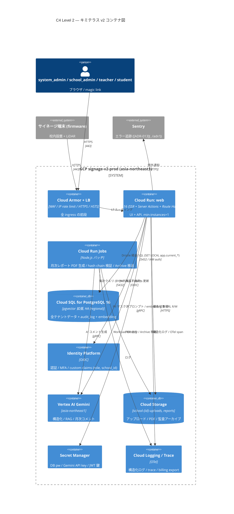

# C4 Level 2: コンテナ図

- 状態: Draft (Part A — Refs #50, 親 #16)
- 最終更新: 2026-05-28
- 関連: [c4-context.md](c4-context.md), [c4-component.md](c4-component.md), [v2-mvp.md](../requirements/v2-mvp.md)

> Level 2 はキミテラス v2 を **デプロイ単位（コンテナ）** に分解する。
> Cloud Run の各サービス / Cloud SQL / Identity Platform / Vertex AI / Cloud Storage / Secret Manager / firmware / Cloud Armor の関係を 1 枚に収める。

---

## 前提

- 全 GCP リソースは **asia-northeast1**（[v2-mvp.md NFR07](../requirements/v2-mvp.md)、データ越境禁止）。
- 全インフラは Terraform で管理（[ADR-009](../adr/), [CLAUDE.md ルール 8](../../CLAUDE.md)）。
- Cloud Run は Workload Identity で Secret Manager にアクセス（JSON キーファイル禁止、[CLAUDE.md ルール 5](../../CLAUDE.md)）。

## 登場ロールと到達点

| ロール | 到達するコンテナ |
|---|---|
| `system_admin` / `school_admin` / `teacher` | Cloud Armor → Cloud Run `web` |
| `student` | Cloud Armor → Cloud Run `web`（magic link URL） |
| `firmware` (端末) | Cloud Armor → Cloud Run `web` の firmware 専用 Route Handler |
| `advertiser` | システム外（PDF を対面/メール受領のみ） |

## コンテナ図

## 各コンテナの責務

| コンテナ | 責務 | スケール |
|---|---|---|
| Cloud Armor + LB | WAF, IP rate limit, HTTPS / HSTS 終端 | マネージド |
| Cloud Run `web` | UI (SSR) + API (Route Handlers) + Server Actions + SSE ストリーミング | min=1, max=10 |
| Cloud Run Jobs | 月次レポート PDF 生成、audit_log の hash chain 検証、1 年経過分の Cloud Storage Archive 移送 | スケジュール起動 |
| Cloud SQL PG16 | 全テナントデータ + pgvector embedding + audit_log。RLS 強制 | HA (regional) |
| Identity Platform | 認証・MFA（teacher 以上）・custom claims (`role`, `school_id`) | マネージド |
| Vertex AI Gemini | 構造化抽出 / RAG / 月次コメント。region 固定 | マネージド |
| Cloud Storage | `school-{id}-uploads/`, `reports/`, `audit-archive/` | バケット |
| Secret Manager | API キー / DB 認証 / JWT 鍵。コミット禁止 | マネージド |
| Cloud Logging / Trace | 構造化ログ + OTel trace + BigQuery export | マネージド |
| Sentry | 例外集約 (PII マスク済ペイロードのみ送信) | 外部 SaaS |

## データの流れ

### 入稿 → 即公開
1. teacher が `web` に file / 音声 / text 入稿。
2. `web` が PII マスク → `vertex` で構造化 → confidence_score 付きで `sql` に書込。
3. content_versions に新バージョン append。publish 操作も audit_log。

### 生徒 Q&A
1. student が magic link で `web` にアクセス（Cloud Armor の rate limit を通過）。
2. `web` が `sql` から自校 (school_id) の RAG 対象を取得 → PII マスク → `vertex` で SSE 応答 → ai_chat_messages に保管。

### 月次レポート
1. `jobs` が月初に起動 → `sql` を集計 + `vertex` で AI コメント生成 → PDF を `gcs` に出力 → monthly_reports に行追加。
2. system_admin が `web` から DL → 対面 / メールで広告主・学校へ配布（自動配信なし）。

## 監査ポイント（Level 2 視点）

- **RLS 強制**: アプリロールは `BYPASSRLS` を持たない。migration ロールのみ持つ（[v2-mvp.md §7](../requirements/v2-mvp.md)）。
- **接続境界での `SET LOCAL`**: `web` は Route Handler ごとに `SET LOCAL app.current_user_id / school_id / role` を実施（プール再利用時のリーク防止）。
- **AI トラフィックの追跡**: `web` / `jobs` → `vertex` の全呼出を ai_extractions / ai_chat_messages に記録（プロンプト・応答・トークン数・confidence）。
- **Secret 漏洩防止**: ログに secret を出力しない（[CLAUDE.md ルール 5](../../CLAUDE.md)）。`obs` 側で `gitleaks` 相当の検索を運用。
- **データ越境ゼロ**: 全 GCP リソースが asia-northeast1。Sentry へは PII マスク済ペイロードのみ送信。

## 関連 ADR

- [ADR-001 PostgreSQL](../adr/) / [ADR-002 Cloud Run](../adr/) / [ADR-003 Identity Platform](../adr/) / [ADR-005 Vertex AI](../adr/)
- [ADR-007 pgvector](../adr/) / [ADR-008 Route Handlers](../adr/) / [ADR-009 Terraform](../adr/) / [ADR-013 Sentry](../adr/) / [ADR-014 観測](../adr/)
- 新規想定: ADR-019 RLS 二層分離 (school_id + system_admin cross-tenant)
