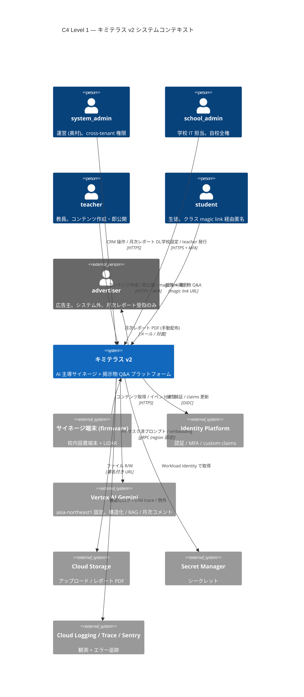

# C4 Level 1: システムコンテキスト

- 状態: Draft (Part A — Refs #50, 親 #16)
- 最終更新: 2026-05-28
- 関連: [v2-mvp.md §3 ロール](../requirements/v2-mvp.md), [CLAUDE.md](../../CLAUDE.md)

> Level 1 は **キミテラス v2 を 1 つの箱** として扱い、利用者（人）と外部システム（GCP マネージドサービス・端末）との関係を描く。
> Level 2 (Container) は [c4-container.md](c4-container.md)、Level 3 (Component) は [c4-component.md](c4-component.md) を参照。

---

## 前提

- 対象は公立高校のサイネージ + AI 対話プラットフォーム（[v2-mvp.md §1](../requirements/v2-mvp.md) 参照）。
- 1 校 = 1 テナント (`school_id`)。テナント分離は PostgreSQL RLS で DB レベルで強制（[ADR-001](../adr/), [CLAUDE.md ルール 2](../../CLAUDE.md)）。
- 広告主はシステム外。月次レポート PDF を `system_admin` から対面 / メールで受領（[v2-mvp.md §3.1](../requirements/v2-mvp.md)）。

## 登場ロール

| アクター | 種別 | 役割 |
|---|---|---|
| `system_admin` | 人（運営） | cross-tenant 権限。CRM、月次レポート配布、ロール付与 |
| `school_admin` | 人（学校 IT 担当） | 自校 `school_id` 内の全権限。teacher アカウント発行、設定 |
| `teacher` | 人（教員） | コンテンツ作成・編集・即公開、magic link 発行、AI 利用 |
| `student` | 人（生徒） | クラス magic link 経由匿名アクセス。閲覧 + 掲示物 Q&A のみ |
| `advertiser` | 人（広告主） | システム**外**。月次レポートのみ受領 |
| サイネージ端末 (firmware) | 外部システム | 校内設置の表示端末。LiDAR 滞留計測も担う |
| Identity Platform | 外部 GCP | 認証 / MFA / custom claims |
| Vertex AI Gemini (asia-northeast1) | 外部 GCP | AI 構造化・RAG・効果コメント生成 |
| Cloud Storage | 外部 GCP | アップロードファイル・月次レポート PDF 保管 |
| Secret Manager | 外部 GCP | API キー・DB 認証情報 |
| Cloud Logging / Trace | 外部 GCP | 観測 ([ADR-014](../adr/)) |
| Sentry | 外部 SaaS | エラー追跡 ([ADR-013](../adr/)) |

## システムコンテキスト図

## データの流れ（俯瞰）

1. **入力**: teacher が file / 音声 / chat で入稿 → キミテラス v2 が PII マスク → Vertex AI で構造化 → DB へ即公開。
2. **配信**: firmware と student の magic link 経由で公開コンテンツを取得。
3. **計測**: イベント (view / tap / dwell / ask) を events テーブルに記録。
4. **可視化**: ダッシュボード + 月次レポート PDF（Cloud Run Job）→ system_admin が手動配布。
5. **監査**: 全 DB 変更 + 全 AI 呼出を audit_log / ai_extractions / ai_chat_messages に append-only 記録（10 年）。

## 監査ポイント（Level 1 視点）

- **テナント境界の侵犯検出**: `school_id` を持つ全テーブルは RLS 必須。アプリ層 WHERE 句に依存しない（[CLAUDE.md ルール 2](../../CLAUDE.md)）。
- **AI 委託の追跡**: Vertex AI への送信は事実上の外部委託扱い。PII マスク前後ログ + トークン数を ai_extractions に保管（[CLAUDE.md ルール 4](../../CLAUDE.md)）。
- **広告主データ越境なし**: 広告主はシステム外。生徒個人特定情報は広告主に届かない（client_id は cookie uuid のみ）。
- **データ越境なし**: Vertex AI も asia-northeast1 固定（[v2-mvp.md NFR07](../requirements/v2-mvp.md)）。

## 関連 ADR

- [ADR-001 PostgreSQL 採用](../adr/) / [ADR-002 Cloud Run](../adr/) / [ADR-003 Identity Platform](../adr/)
- [ADR-005 Vertex AI](../adr/) / [ADR-007 pgvector](../adr/) / [ADR-008 Route Handlers](../adr/)
- 新規想定: ADR-016 magic link 匿名アクセス, ADR-019 RLS 二層分離
