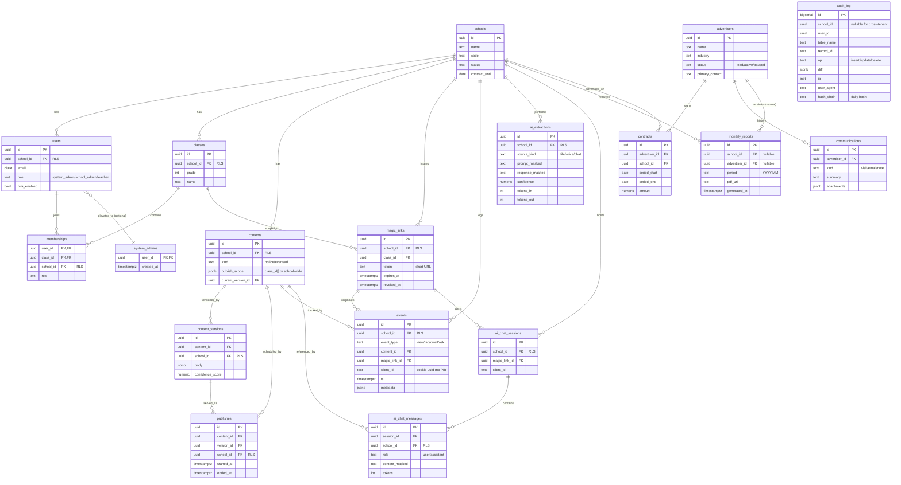

# データモデル ER 図

- 状態: Draft (Part A — Refs #50, 親 #16)
- 最終更新: 2026-05-28
- 関連: [v2-mvp.md §6 データモデル概念設計](../requirements/v2-mvp.md), [c4-container.md](c4-container.md)

> Mermaid `erDiagram` で [v2-mvp.md §6.2](../requirements/v2-mvp.md) の 17 テーブル + 関連を描く。
> 概念レベルの図。確定 DDL は `packages/db/schema/*.ts` で Drizzle により管理（[ADR-004](../adr/), [CLAUDE.md ルール 3](../../CLAUDE.md)）。

---

## 前提

- 全テーブルに監査カラム必須: `created_at`, `updated_at`, `created_by`, `updated_by` ([CLAUDE.md ルール 1](../../CLAUDE.md))。図の冗長を避けるため ER 図上では省略する。
- `school_id` を持つテーブルは PostgreSQL RLS 強制 ([CLAUDE.md ルール 2](../../CLAUDE.md))。RLS 列は ER 図の右側脚注で示す。
- `audit_log` は append-only。1 年経過分は `jobs` が Cloud Storage Archive へ移送（[v2-mvp.md §8.1](../requirements/v2-mvp.md)）。

## 登場ロールとテーブル

| ロール | 主に触れるテーブル |
|---|---|
| `system_admin` | `system_admins`, `advertisers`, `contracts`, `communications`, `monthly_reports`（全 school 閲覧可） |
| `school_admin` | `schools`(自校), `users`, `classes`, `memberships`, `monthly_reports`(自校), `audit_log`(自校) |
| `teacher` | `contents`, `content_versions`, `publishes`, `magic_links`, `ai_extractions`, `events`(閲覧) |
| `student` | `magic_links`(read経由), `contents`(公開分), `ai_chat_sessions`, `ai_chat_messages`, `events` |
| `advertiser` | 直接アクセスなし（システム外）|

## ER 図

## RLS 適用テーブル一覧

| RLS 有 (school_id 必須) | RLS 無 (cross-tenant) |
|---|---|
| schools, users, classes, memberships, magic_links | system_admins |
| contents, content_versions, publishes | advertisers |
| events, ai_extractions, ai_chat_sessions, ai_chat_messages | contracts |
| monthly_reports（school_id 有のとき） | communications, monthly_reports（advertiser_id のみのとき）, audit_log |

> **注**: `monthly_reports` は学校別と広告主別の 2 種があるため、`school_id` / `advertiser_id` のどちらかが入る。RLS は `school_id IS NULL OR school_id = current_setting(...)` のように **null セーフ** に書く。

## データの流れ

1. **入稿**: `contents` ← `content_versions` (新バージョン毎に append) ← `ai_extractions` (確信度・トークン数)。
2. **公開**: `publishes` に行追加（rollback も新 version を追加し、ここに新 row）。
3. **配信**: `events` に view/tap/dwell/ask を append。client_id は cookie uuid（個人特定なし）。
4. **Q&A**: `ai_chat_sessions` → `ai_chat_messages` (PII マスク後本文のみ保管)。
5. **集計**: `monthly_reports` を Cloud Run Jobs が月初生成、`audit_log` の hash_chain を日次検証。

## 監査ポイント（ER 視点）

- **全テーブルに監査カラム**: 図上は省略しているが DDL では必須（[CLAUDE.md ルール 1](../../CLAUDE.md)）。`system_admins` / `audit_log` も例外なし（マスタ改竄・ログ改竄こそ追跡したい）。
- **content_versions は全バージョン保管**: rollback の証跡 + 即公開の安全網（[v2-mvp.md §8.2](../requirements/v2-mvp.md)）。物理削除しない。
- **PII は ai_* テーブルへマスク後のみ保管**: マスキング対応表は永続化しない（[v2-mvp.md §9.4](../requirements/v2-mvp.md)）。
- **audit_log の hash_chain**: 日次 hash で改竄検知（[v2-mvp.md NFR04](../requirements/v2-mvp.md)）。
- **monthly_reports は手動配布**: 自動配信パイプラインなし。広告主はシステム外（[v2-mvp.md F09 / F10](../requirements/v2-mvp.md)）。

## 本 PR の対象外（Part B/C で扱う）

- シーケンス図群（login, file-extraction, voice, instant-publish, rollback, magic-link, student-qa, event-logging, monthly-report）
- Drizzle スキーマ TS 実装（別 issue：#15）

## 関連 ADR

- [ADR-001 PostgreSQL](../adr/) / [ADR-004 Drizzle](../adr/) / [ADR-007 pgvector](../adr/)
- 新規想定: ADR-015 即公開 + 安全網, ADR-016 magic link 匿名, ADR-019 RLS 二層分離
