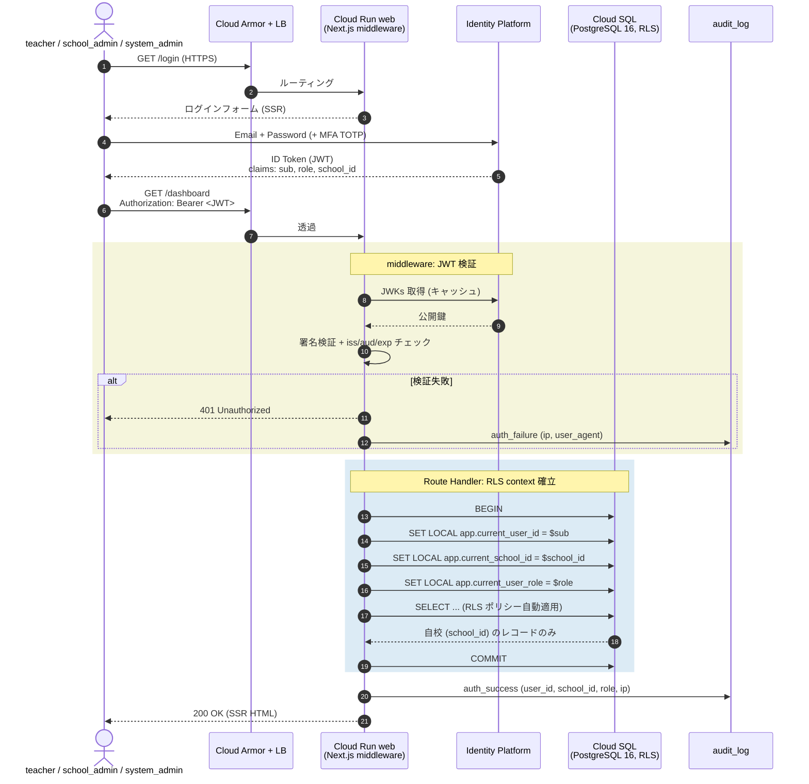

# シーケンス: 認証 → RLS context 確立 (F11)

- 状態: Draft (Part B — Refs #56, 親 #16)
- 最終更新: 2026-05-28
- 関連: [F11](../../requirements/functional/F11-role-management.md), [ADR-003](../../adr/), [ADR-019](../../adr/019-rls-two-layer-tenant-isolation.md), [c4-container.md](../c4-container.md)

## 前提

- 認証は **Identity Platform (OIDC)** を採用 ([ADR-003](../../adr/))。
- teacher 以上は **MFA 強制**（[F11](../../requirements/functional/F11-role-management.md), [NFR03](../../requirements/non-functional/NFR03-security.md)）。
- custom claims に `role` と `school_id` を格納。フロントから書込み不可、Cloud Run 特権ロール経由のみ更新。
- マルチテナント分離は **PostgreSQL RLS 二層**（[ADR-019](../../adr/019-rls-two-layer-tenant-isolation.md)）。

## 登場ロール

| ロール | 役割 |
|---|---|
| `teacher` / `school_admin` / `system_admin` | ブラウザでログインするユーザー |
| Cloud Armor + LB | ingress, WAF, rate limit |
| Cloud Run `web` (Next.js middleware + Route Handler) | JWT 検証 + `SET LOCAL` |
| Identity Platform | OIDC トークン発行 + custom claims |
| Cloud SQL (PostgreSQL 16) | RLS ポリシー適用 |

## シーケンス

## データ流れ

1. ユーザー → Identity Platform で OIDC ログイン（MFA 含む）。
2. Identity Platform が JWT を発行（custom claims: `role`, `school_id`）。
3. ブラウザ → Cloud Armor → Cloud Run `web` に Authorization ヘッダで JWT を提示。
4. Next.js middleware が JWKs で署名検証し、`iss` / `aud` / `exp` をチェック。
5. Route Handler 開始時にトランザクションを張り、`SET LOCAL app.current_*` を発行 → 以降のクエリは RLS ポリシーで自校スコープに限定される。
6. すべての認証イベント（成功・失敗）を `audit_log` に append-only で記録。

## 監査ポイント

- **JWT 偽造防止**: 公開鍵検証 + `iss` / `aud` / `exp` チェックを middleware で必須化（[ADR-003](../../adr/)）。
- **MFA 強制**: teacher 以上は MFA なしの JWT を拒否（custom claims `mfa_enrolled=true` を確認、[F11](../../requirements/functional/F11-role-management.md)）。
- **RLS context 漏れ防止**: コネクションプール再利用時に context が残らないよう `SET LOCAL`（トランザクションスコープ）を使用（[ADR-019](../../adr/019-rls-two-layer-tenant-isolation.md) 「悪い影響」参照）。
- **未設定時拒否**: `current_setting('app.current_school_id', true)` が NULL の場合、ポリシー条件 `school_id = NULL` が False となりアクセス拒否される（拒否デフォルト）。
- **auth イベント監査**: 成功・失敗・MFA 失敗・JWT 失効を全件 `audit_log` に記録（[NFR04](../../requirements/non-functional/NFR04-audit-log.md)）。

## 関連 ADR

- [ADR-003 Identity Platform](../../adr/)（認証基盤の選定根拠）
- [ADR-019 RLS 二層分離](../../adr/019-rls-two-layer-tenant-isolation.md)（`SET LOCAL` 必須化）
- [ADR-008 Next.js Route Handlers](../../adr/)（middleware + Handler の境界）
