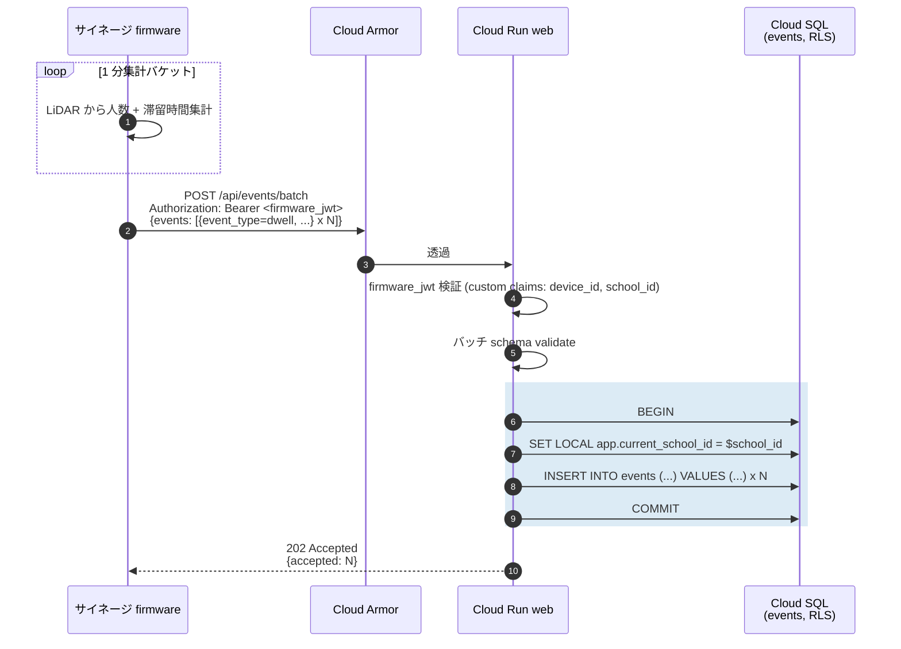
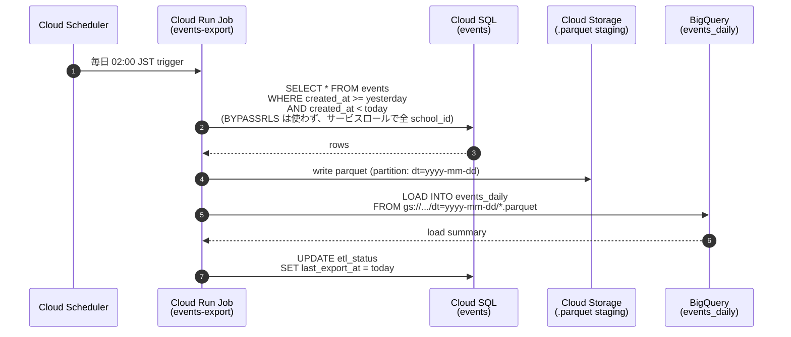

# シーケンス: イベントロギング — tap/view/dwell/ask → events → BigQuery (F07)

- 状態: Draft (Part C — Refs #60, 親 #16)
- 最終更新: 2026-05-29
- 関連: [F07](../../requirements/functional/F07-event-logging.md), [ADR-001](../../adr/001-postgres-vs-firestore.md), [ADR-014](../../adr/014-observability.md), [magic-link-issuance.md](magic-link-issuance.md), [student-qa.md](student-qa.md)

## 前提

- 生徒端末は `client_id` cookie + `magic_link_id` セッションを保持済み（[magic-link-issuance.md](magic-link-issuance.md)）。
- events は **個人特定情報を持たない**（`client_id` cookie uuid のみ）。氏名・学籍番号は記録しない（[F07](../../requirements/functional/F07-event-logging.md)）。
- ページ遷移時もロスなく送信するため、`navigator.sendBeacon()` を採用。送信は fire-and-forget。
- BigQuery 連携は Datastream または Cloud Run Job による定期 ETL。**MVP は近リアルタイム不要、日次バッチで十分**。
- LiDAR センサーからの dwell データも同じ events テーブルに統合（[F12](../../requirements/functional/F12-v1-port.md)）。
- audit_log と events は別テーブル: audit_log は **改竄検知 + 法定保存**、events は **集計・分析用**（[NFR04](../../requirements/non-functional/NFR04-audit-log.md)）。

## 登場ロール

| ロール | 役割 |
|---|---|
| 生徒端末ブラウザ | tap / view / dwell イベント発火 + beacon 送信 |
| サイネージ端末 (firmware) | view / dwell + LiDAR 集計を Cloud Run に送信 |
| Cloud Armor | 静的バリデーション + DDoS 防御 |
| Cloud Run `web` (`/api/events`) | スキーマ検証 + RLS context + INSERT |
| Cloud SQL (PostgreSQL 16) | events テーブル (RLS 適用) |
| Datastream / Cloud Run Job | events → BigQuery 日次同期 |
| BigQuery | 効果ダッシュボード ([F08](../../requirements/functional/F08-effect-dashboard.md)) と月次レポート ([F09](../../requirements/functional/F09-monthly-report.md)) のデータソース |

## シーケンス: 生徒ブラウザの tap / view

```mermaid
sequenceDiagram
  autonumber
  actor S as 生徒端末ブラウザ
  participant Armor as Cloud Armor
  participant Web as Cloud Run web<br/>(/api/events)
  participant DB as Cloud SQL<br/>(events, RLS)

  note over S: ユーザー操作 (tap / view / link click)<br/>or beforeunload で dwell 集計
  S->>S: navigator.sendBeacon(<br/>"/api/events",<br/>JSON.stringify({event_type, content_id, magic_link_id, metadata}))
  S->>Armor: POST /api/events (Content-Type: application/json)
  Armor->>Armor: 1000 req/min/IP rate limit
  Armor->>Web: 透過 (fire-and-forget; 202 期待)

  rect rgb(220,235,245)
    note over Web,DB: 検証 + INSERT (RLS)
    Web->>Web: magic_link_id → school_id 解決 (cache OK)
    Web->>Web: schema validate (Zod)<br/>event_type ∈ {view,tap,dwell,ask}
    Web->>DB: BEGIN
    Web->>DB: SET LOCAL app.current_school_id = $school_id
    Web->>DB: INSERT INTO events<br/>(school_id, event_type, content_id,<br/>magic_link_id, client_id, metadata, ...)
    Web->>DB: COMMIT
  end

  Web-->>S: 202 Accepted (body 空)
  note over S,Web: beacon はレスポンス body を破棄。<br/>ページ遷移後でも送信完了する。
```

## シーケンス: サイネージ端末からの dwell (LiDAR 集計)



## シーケンス: BigQuery 日次同期



## データ流れ

1. 生徒タップ → `navigator.sendBeacon('/api/events', payload)` で fire-and-forget 送信。`beforeunload` でも確実に送信される。
2. Cloud Armor で IP rate limit を通過後、Web Route Handler が Zod でスキーマ検証 + `magic_link_id → school_id` 解決（Memorystore キャッシュ）。
3. `SET LOCAL app.current_school_id` を実行し、RLS 配下で events に INSERT。
4. サイネージ端末は firmware_jwt 付きで `/api/events/batch` にバッチ送信。device_id 単位の dwell データを events に投入。
5. Cloud Scheduler が毎日 02:00 JST に `events-export` Job をトリガ。前日分の events を parquet 化し GCS に staging → BigQuery `events_daily` テーブルへ LOAD。
6. BigQuery のテーブルは効果ダッシュボード（[F08](../../requirements/functional/F08-effect-dashboard.md)）と月次レポート（[F09](../../requirements/functional/F09-monthly-report.md)）のデータソースになる。

## 監査ポイント

- **個人特定情報の混入禁止**: schema validate で `metadata` に氏名・電話・住所等の PII キーがないか拒否リストでチェック（[F07](../../requirements/functional/F07-event-logging.md), [CLAUDE.md ルール 4](../../../CLAUDE.md)）。
- **events は audit_log と分離**: events は集計用で改竄検知の対象外、append-only ではなく集計列の更新が可能。一方 audit_log は append-only + 改竄ハッシュ（[NFR04](../../requirements/non-functional/NFR04-audit-log.md)）。混同しない。
- **RLS 漏れ防止**: 生徒は magic_link 経由なので JWT を持たない → `magic_link_id` から school_id を逆引きして `SET LOCAL` する。逆引き失敗時は 400 Bad Request（RLS 配下で INSERT すると 0 row affected）。
- **firmware の認証**: サイネージ端末は別 OIDC client として Identity Platform で発行された JWT を使用。`device_id` を含む custom claims を検証（device 紐付けは school_id とセット）。
- **beacon は冪等性なし**: クライアント側でリトライしないため、サーバー側で `(client_id, content_id, event_type, timestamp_minute)` 単位のソフト重複排除（集計時に DISTINCT）を許容。
- **BigQuery export はサービスロール経由**: `BYPASSRLS` 権限ロールではなく、`pg_dump` ではなく、export 専用ロールで `school_id ANY` 読み取り権限を付与。export ロールは write 不可で監査ログに残る（[CLAUDE.md ルール 2](../../../CLAUDE.md) 例外管理）。
- **export 失敗の検知**: `etl_status.last_export_at` を毎日チェックし、>24h 経過時は Sentry にアラート（[ADR-013](../../adr/013-sentry.md), [ADR-014](../../adr/014-observability.md)）。

## 関連 ADR

- [ADR-001 PostgreSQL](../../adr/001-postgres-vs-firestore.md)（events も同じ DB、JOIN コスト低）
- [ADR-014 Observability](../../adr/014-observability.md)（Cloud Logging + Trace 経路）
- [ADR-019 RLS 二層](../../adr/019-rls-two-layer-tenant-isolation.md)（events も RLS 対象、export は専用ロール）
- [ADR-013 Sentry](../../adr/013-sentry.md)（export 失敗時のアラート）
