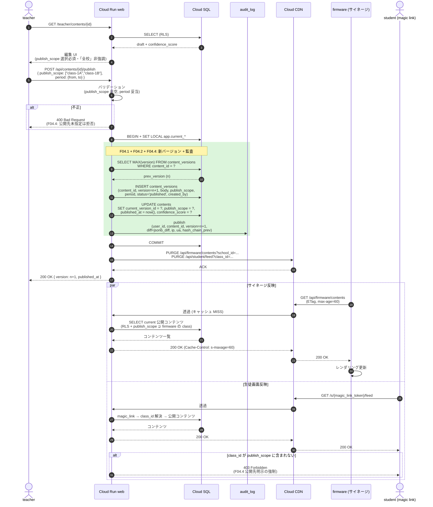

# シーケンス: 即公開フロー (F04)

- 状態: Draft (Part B — Refs #56, 親 #16)
- 最終更新: 2026-05-28
- 関連: [F04](../../requirements/functional/F04-instant-publish-safety-nets.md), [ADR-015](../../adr/015-instant-publish-with-safety-nets.md), [ADR-019](../../adr/019-rls-two-layer-tenant-isolation.md)

## 前提

- **承認フローなし** → 教員が「公開」を押した瞬間に反映（[ADR-015](../../adr/015-instant-publish-with-safety-nets.md)）。
- 4 種の安全網で事後対応:
  - F04.1 audit_log（全公開操作 append-only）
  - F04.2 1-click rollback（[rollback.md](rollback.md)）
  - F04.3 AI 確信度フラグ（confidence_score < 0.7 は「⚠️ 要確認」）
  - F04.4 公開先明示（`publish_scope` NOT NULL）
- 配信は **Cloud CDN（最大 60 秒キャッシュ）** 経由でサイネージ端末 + magic link 経由生徒画面に反映。
- 認証 / RLS context は [auth-login.md](auth-login.md) 完了済前提。下書きは [teacher-file-extraction.md](teacher-file-extraction.md) または [teacher-voice-input.md](teacher-voice-input.md) で作成済。

## 登場ロール

| ロール | 役割 |
|---|---|
| `teacher` | 公開ボタンを押す教員 |
| Cloud Run `web` | 公開 Route Handler |
| Cloud SQL | `contents` / `content_versions` / `audit_log` |
| Cloud CDN | `/api/firmware/contents` / `/api/student/...` のキャッシュ |
| `firmware` | サイネージ端末（校内） |
| `student` (magic link) | 生徒スマホ/タブレット |

## シーケンス

## データ流れ

1. teacher が編集 UI で `publish_scope` を選択 → 公開ボタン押下。
2. `web` が `content_versions` に新バージョンを append、`contents.current_version_id` を更新。**前バージョンは保持**（rollback 用）。
3. `audit_log` に publish イベントを append-only 記録。`diff` は jsonb_diff、`hash_chain_prev` で改竄検知。
4. CDN を PURGE → サイネージ・生徒画面が最大 60 秒以内に反映。
5. 生徒側の class_id が `publish_scope` に含まれない場合は 403（F04.4 強制）。

## 監査ポイント

- **append-only audit_log**: publish/update/unpublish/rollback を全件記録。`hash_chain_prev` で改竄検知（[NFR04](../../requirements/non-functional/)）。
- **content_versions 不変**: 旧バージョンは UPDATE/DELETE 禁止（DB トリガで強制）。rollback も新バージョン append。
- **publish_scope NOT NULL**: スキーマで強制（F04.4）。曖昧な「全校」ボタンを UI で非強調。
- **RLS**: `contents` / `content_versions` / `audit_log` 全テーブルが school_id スコープ（[ADR-019](../../adr/019-rls-two-layer-tenant-isolation.md)）。
- **CDN キャッシュ整合**: 公開時 PURGE 必須。max 60 秒の遅延を仕様として明示（[F04](../../requirements/functional/F04-instant-publish-safety-nets.md)）。
- **AI 確信度の伝搬**: `contents.confidence_score < 0.7` を UI で「⚠️ 要確認」表示（F04.3）。

## 関連 ADR

- [ADR-015 即公開 + 安全網](../../adr/015-instant-publish-with-safety-nets.md)
- [ADR-019 RLS 二層分離](../../adr/019-rls-two-layer-tenant-isolation.md)
- [ADR-008 Next.js Route Handlers](../../adr/)
- 関連: [rollback.md](rollback.md)（F04.2 詳細）
