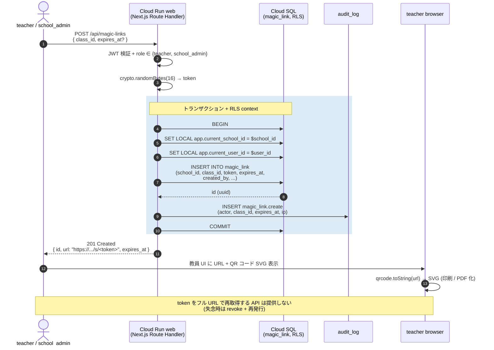
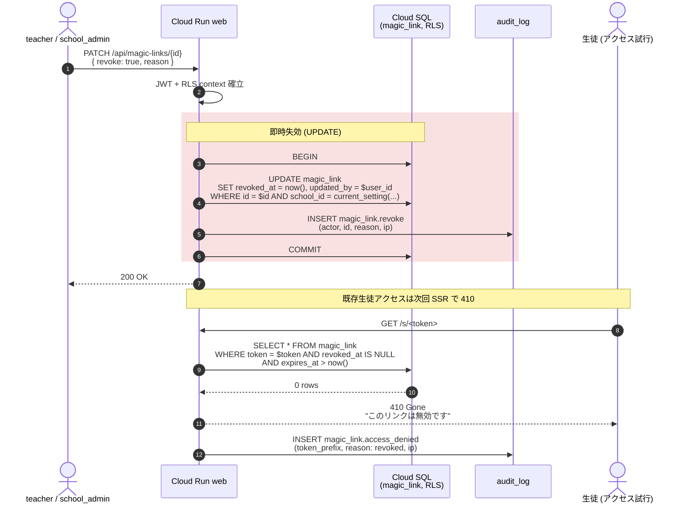
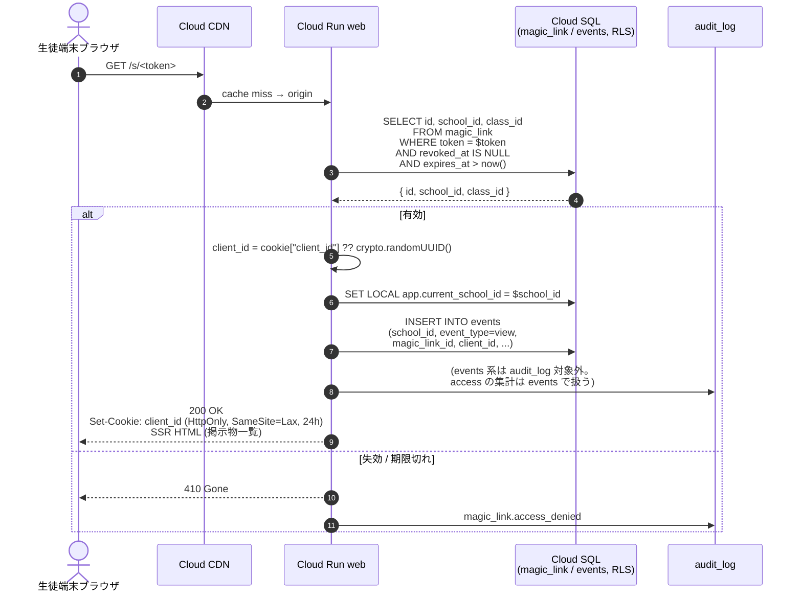

# シーケンス: クラス magic link 発行 → QR 配布 → 失効 (F05)

- 状態: Draft (Part C — Refs #60, 親 #16)
- 最終更新: 2026-05-29
- 関連: [F05](../../requirements/functional/F05-class-magic-link.md), [ADR-003](../../adr/), [ADR-016](../../adr/016-class-magic-link-anonymous-access.md), [ADR-019](../../adr/019-rls-two-layer-tenant-isolation.md), [auth-login.md](auth-login.md)

## 前提

- 認証済み `teacher` / `school_admin` が **自校 (school_id) のクラス**に対してのみ発行可能（[ADR-019](../../adr/019-rls-two-layer-tenant-isolation.md) RLS）。
- magic_link テーブルは `token` カラムを保持し、URL 末尾の不透明識別子として使用（[ADR-016](../../adr/016-class-magic-link-anonymous-access.md)）。
- token は cryptographic randomness（>= 128 bit）。教員 UI には**生成直後のみ**フル URL を表示し、それ以降は token を再表示しない（漏洩窓口の最小化）。
- 有効期限デフォルト 90 日、教員から短縮 / 延長 / 即時 revoke 可能（[F05](../../requirements/functional/F05-class-magic-link.md)）。
- QR コード生成はクライアント側で `qrcode` ライブラリにより SVG 化（サーバーに QR 画像を保管しない）。

## 登場ロール

| ロール | 役割 |
|---|---|
| `teacher` / `school_admin` | magic link の発行 / 更新 / revoke を操作 |
| Cloud Run `web` (Next.js Route Handler) | 認可チェック + token 生成 + RLS context 設定 |
| Cloud SQL (PostgreSQL 16) | magic_link / audit_log への書込み (RLS 適用) |
| 教員端末ブラウザ | QR コード SVG レンダリング + 印刷 |
| 生徒端末ブラウザ | magic link 経路で初回アクセス時に client_id cookie 受領 |

## シーケンス: 発行

## シーケンス: 失効 (revoke) / 漏洩検知時

## シーケンス: 生徒初回アクセス (cookie 発行)

## データ流れ

1. 教員が UI から「クラス magic link 発行」を選択 → Route Handler が認可と RLS context を確認後、token を生成し magic_link に INSERT。同時に audit_log に発行イベントを記録。
2. 教員 UI は API レスポンスの URL を QR コード SVG にクライアント側でレンダリング。サーバーは QR 画像を保管しない。
3. 漏洩検知時または期限到来時、教員 UI から revoke API を呼び `revoked_at` を更新。audit_log に revoke イベントを記録。
4. 生徒は URL から SSR ページにアクセス。Web は magic_link の有効性を確認し、有効なら `client_id` cookie を発行（HttpOnly + SameSite=Lax + 24h）。
5. 既発行 cookie を持つ生徒のアクセスは events に view として記録される（個人特定なし、cookie の uuid のみ）。

## 監査ポイント

- **token 漏洩窓口の最小化**: 生成直後の API レスポンスのみフル URL を返す。GET API では `token_prefix`（先頭 8 文字）と masked 表示のみ。フル token は DB にのみ存在し、教員でも再表示不可（[ADR-016](../../adr/016-class-magic-link-anonymous-access.md) 「漏洩リスク」対策）。
- **token 強度**: 128 bit cryptographic randomness を保証（`crypto.randomBytes(16)`）。総当たり攻撃に対し十分。
- **RLS 自校スコープ強制**: `school_id` は JWT custom claims から `SET LOCAL`、ペイロード由来の `school_id` パラメータは受け付けない（クロステナント発行防止、[CLAUDE.md ルール 2](../../../CLAUDE.md)）。
- **revoke 監査**: revoke 時の `actor` / `reason` / `ip` を audit_log に記録（[NFR04](../../requirements/non-functional/NFR04-audit-log.md)）。インシデント時に「いつ誰がどの理由で失効させたか」を追跡できる。
- **失効後アクセスも記録**: 410 Gone を返すアクセスも audit_log に `token_prefix` 付きで記録（漏洩 URL のスキャン検知に利用）。
- **cookie scope**: `client_id` cookie は HttpOnly + SameSite=Lax。XSS による盗難と CSRF を抑制。個人情報は一切含まない。
- **token を URL クエリではなくパス末尾に置く**: ブラウザの Referer ヘッダや HTTP log に流出しないよう、`/s/<token>` の path 形式（クエリパラメータ禁止）。

## 関連 ADR

- [ADR-016 クラス magic link 匿名アクセス](../../adr/016-class-magic-link-anonymous-access.md)（採用根拠、漏洩リスク対策）
- [ADR-003 Identity Platform](../../adr/)（教員側認証経路）
- [ADR-019 RLS 二層分離](../../adr/019-rls-two-layer-tenant-isolation.md)（school_id 強制）
- [ADR-008 Next.js Route Handlers](../../adr/)（middleware + Handler 境界）
