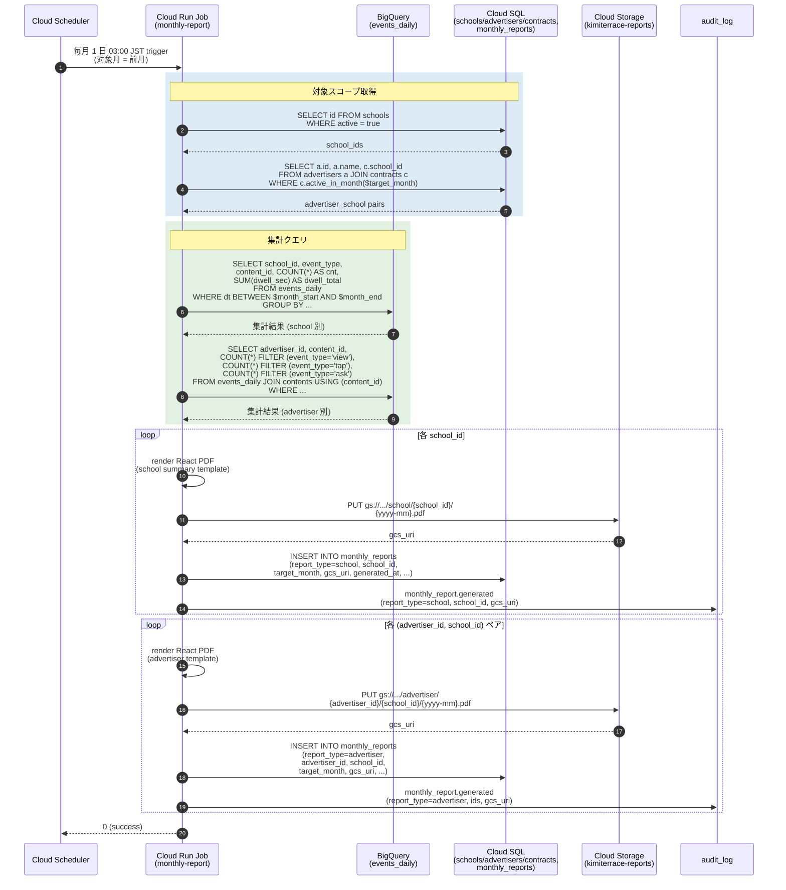
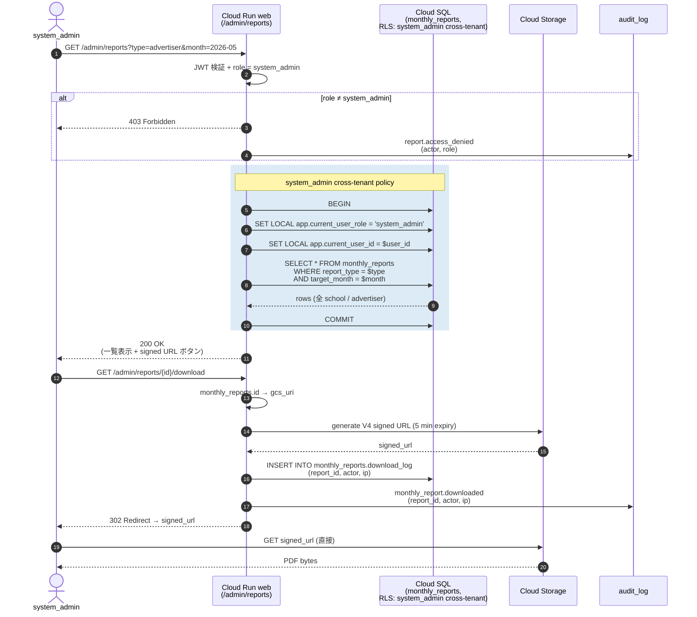
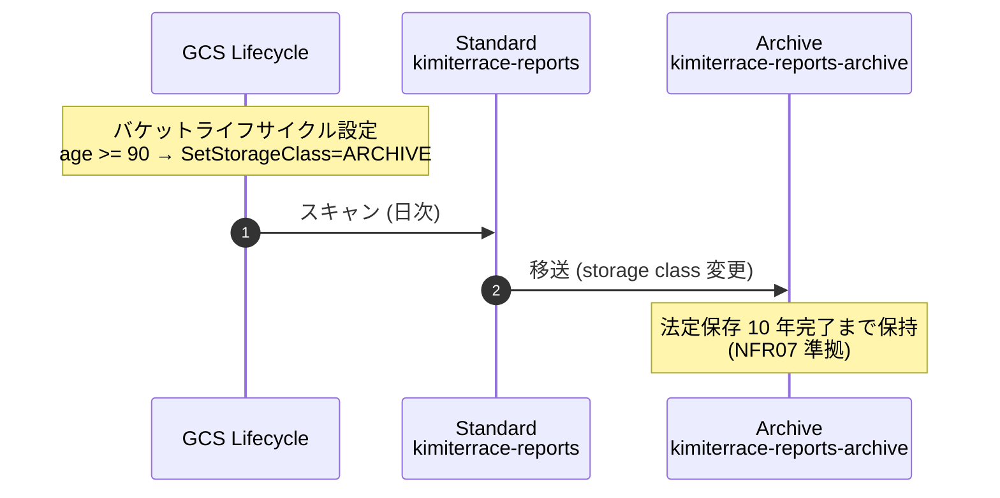

# シーケンス: 月次レポート — Cloud Run Job → PDF 生成 → system_admin DL (F09)

- 状態: Draft (Part C — Refs #60, 親 #16)
- 最終更新: 2026-05-29
- 関連: [F09](../../requirements/functional/F09-monthly-report.md), [ADR-002](../../adr/002-cloud-run-vs-functions.md), [event-logging.md](event-logging.md), [F08](../../requirements/functional/F08-effect-dashboard.md), [F10](../../requirements/functional/F10-crm.md)

## 前提

- レポート種別は 2 つ:
  1. **学校別レポート**: 教員向け、サイネージ全体の活動サマリー（[F08](../../requirements/functional/F08-effect-dashboard.md) と同じ KPI を 1 ヶ月分集約）
  2. **広告主別レポート**: 広告主との対面コミュニケーション用、その広告主の広告だけの到達・タップ・Q&A 件数
- **自動配信パイプラインは MVP では作らない**（[F09](../../requirements/functional/F09-monthly-report.md)）。生成のみ自動、配布は system_admin が手動で対面 / メール。
- 生成済 PDF は **Cloud Storage に 90 日保管 → コールド移送**。法定保存は 10 年（[NFR07](../../requirements/non-functional/NFR07-compliance.md)）。
- monthly_reports テーブルで生成履歴を管理（誰がいつ生成 / DL したか）。
- PDF 生成エンジン: pdfkit または React PDF を Cloud Run Job 内で実行（[F09](../../requirements/functional/F09-monthly-report.md)）。
- 広告主は **システム外**。直接アクセス権を持たない。CRM ([F10](../../requirements/functional/F10-crm.md)) と紐づけて配布履歴を管理。

## 登場ロール

| ロール | 役割 |
|---|---|
| Cloud Scheduler | 毎月 1 日 03:00 JST に Job をトリガ |
| Cloud Run Job `monthly-report` | events 集計 + CRM JOIN + PDF 生成 + GCS upload |
| BigQuery (`events_daily`) | 集計のデータソース ([event-logging.md](event-logging.md)) |
| Cloud SQL (PostgreSQL 16) | schools / advertisers / contracts / monthly_reports を読み書き |
| Cloud Storage | 生成済 PDF 保管 (`gs://kimiterrace-reports/...`) |
| system_admin | UI から PDF を download |
| audit_log | 生成 / DL / 配布記録 |

## シーケンス: PDF 生成 (月初バッチ)

## シーケンス: system_admin による PDF ダウンロード

## シーケンス: 90 日後コールド移送

## データ流れ

1. Cloud Scheduler が毎月 1 日 03:00 JST に Cloud Run Job `monthly-report` を起動。
2. Job は Cloud SQL から `schools` / `advertisers` / `contracts` を取得し、対象月でアクティブな (school, advertiser) ペアを列挙。
3. BigQuery `events_daily` に集計クエリを発行し、school 別 + advertiser 別の KPI を取得。
4. React PDF で各レポートをレンダリングし、`gs://kimiterrace-reports/<type>/<id>/<yyyy-mm>.pdf` に upload。
5. `monthly_reports` テーブルに生成履歴を INSERT。audit_log に generated イベントを記録。
6. system_admin が UI から一覧表示し、download ボタン押下で 5 分有効の V4 signed URL を発行。download_log + audit_log に記録。
7. 90 日経過した PDF は GCS lifecycle policy で Archive class へ自動移送（10 年法定保存）。

## 監査ポイント

- **system_admin 限定アクセス**: monthly_reports は **RLS 二層の cross-tenant policy** が適用される唯一の経路。`role = system_admin` のみが全 school / advertiser を横断閲覧できる（[ADR-019](../../adr/019-rls-two-layer-tenant-isolation.md)）。
- **download 監査**: download_log + audit_log の両方に記録（download_log は冪等性ある運用フラグ、audit_log は改竄検知付き法的記録）。「いつ誰がどの PDF を取得したか」を 10 年残せる（[NFR04](../../requirements/non-functional/NFR04-audit-log.md), [NFR07](../../requirements/non-functional/NFR07-compliance.md)）。
- **signed URL の短寿命**: 5 分有効。漏洩しても短時間で無効化される。直接ダウンロードリンクを log や share に貼っても再利用不能。
- **広告主直接アクセスの禁止**: 広告主は system 外。`/admin/reports` UI は system_admin ロールのみ。広告主への配布は system_admin が手動で対面 / メール添付（CRM テーブルの communications に記録、[F10](../../requirements/functional/F10-crm.md)）。
- **PDF 内の PII 取扱**: 学校別レポートに教員氏名等を含めない（集計値のみ）。広告主別レポートは「広告主名 + 学校名 + 数値」のみで、個人特定情報を含めない（[CLAUDE.md ルール 4](../../../CLAUDE.md)）。
- **Job 失敗時の再実行**: 月初 Job が失敗した場合、`monthly_reports` への INSERT がない学校を検出し、手動再実行する runbook を用意。Cloud Scheduler の retry policy も exponential backoff で 3 回まで。
- **BigQuery 集計の RLS 対応**: BigQuery 自体に RLS はないが、export 元データが school_id 付きで投入され、Job 内のクエリは school_id 単位で集計 → PDF も school_id 単位で出力されるため、データ越境は発生しない。
- **コールドストレージ復旧コスト**: Archive class からの取得は遅延と費用が発生する旨を system_admin UI に表示（>90 日経過 PDF は復元ボタン）。
- **legal hold**: 訴訟・調査時には対象月の lifecycle 移送を一時停止する設定を runbook 化（[NFR07](../../requirements/non-functional/NFR07-compliance.md)）。

## 関連 ADR

- [ADR-002 Cloud Run + Jobs](../../adr/002-cloud-run-vs-functions.md)（バッチ実行基盤）
- [ADR-019 RLS 二層](../../adr/019-rls-two-layer-tenant-isolation.md)（system_admin cross-tenant policy）
- [ADR-001 PostgreSQL](../../adr/001-postgres-vs-firestore.md)（CRM JOIN 同一 DB）
- [ADR-018 CRM 独自設計](../../adr/018-custom-crm-design.md)（広告主・契約マスタとの紐付け）
