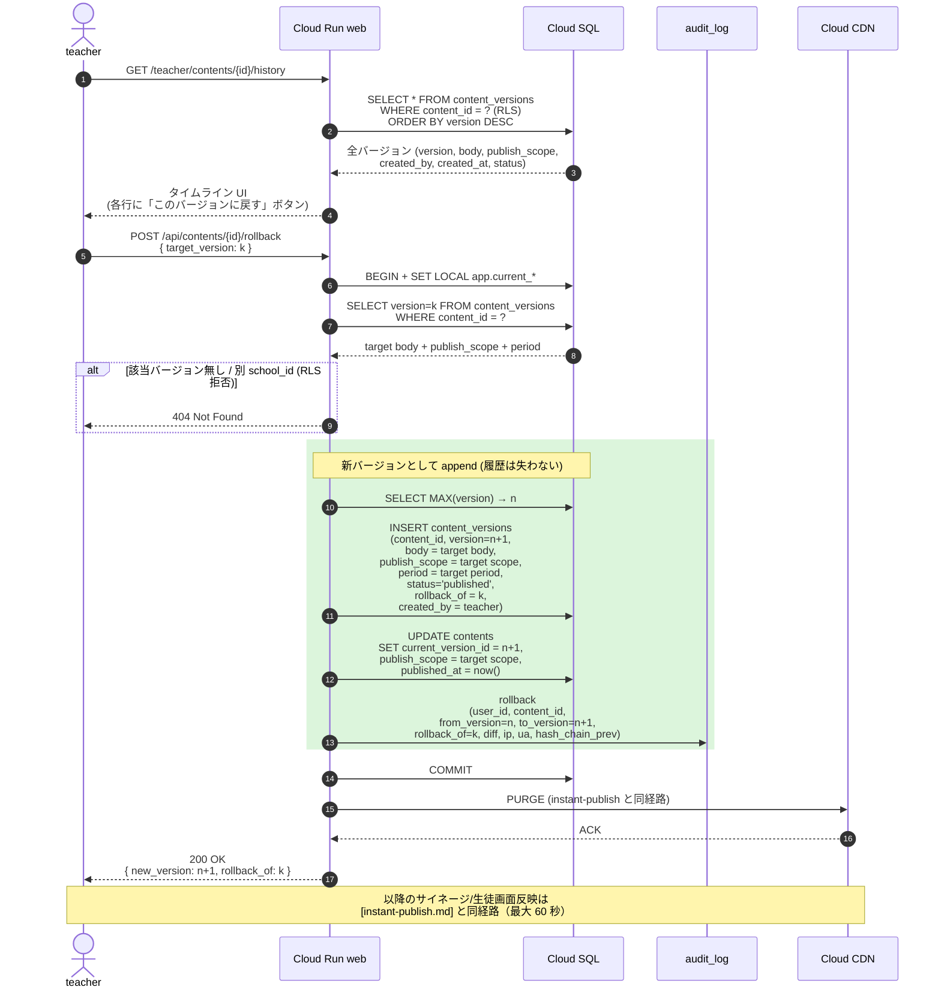

# シーケンス: 1-click rollback (F04.2)

- 状態: Draft (Part B — Refs #56, 親 #16)
- 最終更新: 2026-05-28
- 関連: [F04](../../requirements/functional/F04-instant-publish-safety-nets.md), [ADR-015](../../adr/015-instant-publish-with-safety-nets.md), [ADR-019](../../adr/019-rls-two-layer-tenant-isolation.md)

## 前提

- すべてのコンテンツは `content_versions` に **全バージョン保管**（履歴は失わない、[F04.2](../../requirements/functional/F04-instant-publish-safety-nets.md)）。
- rollback は「過去バージョンへの巻き戻し」だが、**新しい version 番号を採番して append-only に積む**（[ADR-015](../../adr/015-instant-publish-with-safety-nets.md)）。
- 公開状態の更新と CDN PURGE は [instant-publish.md](instant-publish.md) と同経路を再利用。
- 認証 / RLS context は [auth-login.md](auth-login.md) 完了済前提。

## 登場ロール

| ロール | 役割 |
|---|---|
| `teacher` | タイムラインから「このバージョンに戻す」を押す教員 |
| Cloud Run `web` | rollback Route Handler |
| Cloud SQL | `contents` / `content_versions` / `audit_log` |
| Cloud CDN | キャッシュ無効化 |
| `firmware` / `student` | 反映先（[instant-publish.md](instant-publish.md) と同経路） |

## シーケンス

## データ流れ

1. teacher が編集 UI のタイムラインを開く → 全バージョン一覧（RLS で自校のみ）。
2. 「このバージョンに戻す」押下 → `target_version` を指定して rollback リクエスト。
3. `web` が `content_versions` から `target_version` の本文・scope・period を取得。
4. **過去バージョンを直接書き換えない**。代わりに `version = n+1` の新バージョンを append、`rollback_of = k` を記録（履歴の追跡可能性を保つ）。
5. `contents.current_version_id` を更新。`audit_log` に rollback イベントを記録（`from` / `to` / `rollback_of` を含む）。
6. CDN PURGE → サイネージ/生徒画面に最大 60 秒で反映（[instant-publish.md](instant-publish.md) と同経路）。

## 監査ポイント

- **履歴改竄不可**: `content_versions` は append-only（旧行 UPDATE/DELETE はトリガで拒否）。rollback も append。これにより「いつ・誰が・どのバージョンから・どのバージョンに戻したか」が完全に追跡可能。
- **rollback の二重監査**:
  - `content_versions.rollback_of` でバージョン関係を記録
  - `audit_log` で操作者・IP・UA・hash chain を記録（[NFR04](../../requirements/non-functional/)）
- **テナント分離**: RLS により別 school_id のバージョンは `SELECT` 段階で見えない → 不正な rollback 要求は 404 で拒否（情報漏洩防止）。
- **rollback 権限**: 自校コンテンツの rollback は同校 teacher 以上に限定（middleware の role + RLS の二重防御）。
- **CDN 整合**: rollback 後も PURGE 必須。max 60 秒の遅延は instant-publish と同じ。

## 関連 ADR

- [ADR-015 即公開 + 安全網](../../adr/015-instant-publish-with-safety-nets.md)（F04.2 の決定根拠）
- [ADR-019 RLS 二層分離](../../adr/019-rls-two-layer-tenant-isolation.md)
- 関連: [instant-publish.md](instant-publish.md)（公開フローと同経路を再利用）
