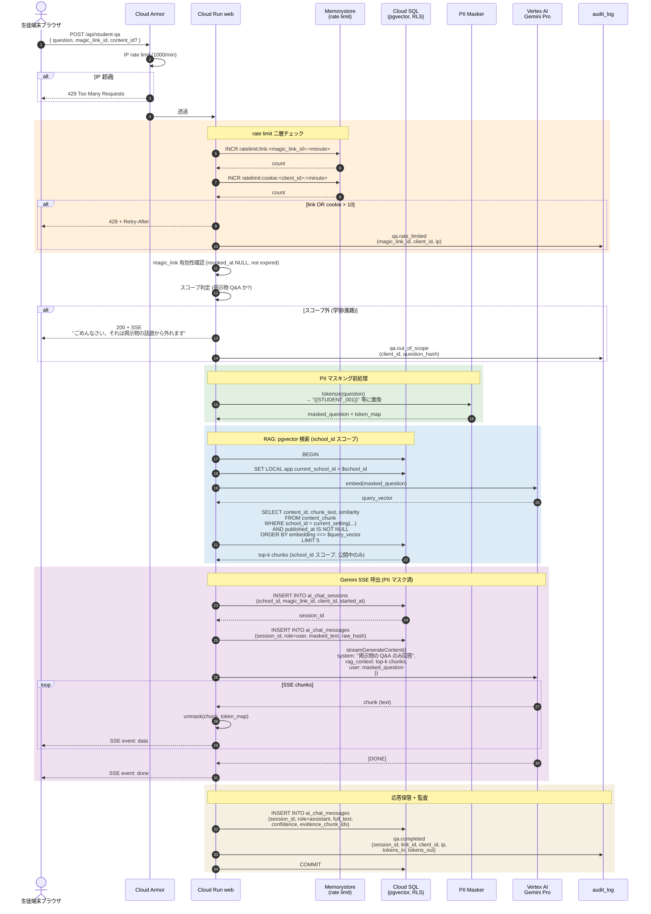

# シーケンス: 生徒 Q&A — RAG → Gemini SSE → 監査 (F06)

- 状態: Draft (Part C — Refs #60, 親 #16)
- 最終更新: 2026-05-29
- 関連: [F06](../../requirements/functional/F06-student-qa.md), [NFR06](../../requirements/non-functional/NFR06-cost-policy.md), [ADR-005](../../adr/005-vertex-ai.md), [ADR-006](../../adr/006-vercel-ai-sdk.md), [ADR-007](../../adr/007-pgvector.md), [ADR-017](../../adr/017-gemini-ai-structuring-with-confidence.md), [magic-link-issuance.md](magic-link-issuance.md)

## 前提

- 生徒は [magic-link-issuance.md](magic-link-issuance.md) のフローで `client_id` cookie + `magic_link_id` セッションを保持済み。
- 質問範囲は **掲示物 (公開中コンテンツ) に関する Q&A のみ**。学習・進路アドバイスは Phase 2 送り（[F06](../../requirements/functional/F06-student-qa.md)）。
- LLM は Gemini Pro 固定（[ADR-005](../../adr/005-vertex-ai.md), [ADR-017](../../adr/017-gemini-ai-structuring-with-confidence.md)）。
- RAG は pgvector による semantic search（[ADR-007](../../adr/007-pgvector.md)）。embedding は事前に `school_id` スコープでマスキング済テキストから生成済み（[CLAUDE.md ルール 4](../../../CLAUDE.md)）。
- ストリーミング応答は Vercel AI SDK 経由の SSE（[ADR-006](../../adr/006-vercel-ai-sdk.md)）。
- rate limit 二層: magic_link あたり 1 分 10 質問 + client_id cookie あたり 1 分 10 質問（[NFR06](../../requirements/non-functional/NFR06-cost-policy.md)）。

## 登場ロール

| ロール | 役割 |
|---|---|
| 生徒端末ブラウザ | 質問入力 + SSE 受信 |
| Cloud Armor | IP ベース DDoS 防御 + 1 分 1000 req/IP |
| Cloud Run `web` (Next.js Route Handler) | 認可 + rate limit + RAG + Gemini 呼出 + SSE 中継 |
| Redis / Memorystore | rate limit カウンタ (`ratelimit:link:<id>`, `ratelimit:cookie:<id>`) |
| Cloud SQL (pgvector) | embedding 検索 + ai_chat_sessions / ai_chat_messages 保管 (RLS) |
| Vertex AI Gemini Pro | 回答生成 (asia-northeast1) |
| audit_log | 質問 / 応答イベント記録 |

## シーケンス

## データ流れ

1. ブラウザ → Cloud Armor で IP 単位 rate limit を通過。
2. Web Route Handler で magic_link / client_id それぞれ 1 分 10 質問の rate limit をチェック（Memorystore の INCR）。超過は 429。
3. 質問テキストをスコープ判定。掲示物外（学習・進路など）は固定文言で拒否し、audit_log に記録。**Gemini 呼出は行わない**（コスト + プロンプトインジェクション対策）。
4. PII マスキング: 質問内の生徒名・住所等を `{{STUDENT_xxx}}` トークンに置換し、token_map を保持。
5. masked_question から embedding を生成 → pgvector で `school_id` スコープの公開中 chunk を top-k 検索。
6. ai_chat_sessions / ai_chat_messages にユーザー発話を保管（masked_text + raw_hash）。生 PII は DB にも書かない。
7. Gemini Pro へ system プロンプト + RAG コンテキスト + masked_question を SSE で投げ、chunk ごとに unmask して生徒に中継。
8. 応答完了後、assistant メッセージを保管（full_text, confidence, evidence_chunk_ids）し、qa.completed を audit_log に記録。

## 監査ポイント

- **PII マスキング不可避**: 生 PII を Gemini に送らない。token 置換失敗時は `confidence < threshold` で応答を破棄（[CLAUDE.md ルール 4](../../../CLAUDE.md)）。
- **DB にも生 PII を残さない**: ai_chat_messages.text は masked、raw_hash のみで「同じ質問の再送」検出可能。生質問は audit_log にも保管しない（漏洩時の影響範囲最小化）。
- **RLS による school_id スコープ徹底**: embedding 検索クエリも RLS 配下で実行。`SET LOCAL` 漏れがあれば 0 行返却される拒否デフォルト（[ADR-019](../../adr/019-rls-two-layer-tenant-isolation.md)）。
- **公開中フィルタ**: `published_at IS NOT NULL` を pgvector クエリ条件に含め、下書きや revoke 済掲示物が漏れないようにする。
- **rate limit の二層化**: magic_link 単位 + client_id 単位の AND。複数 cookie を持つ攻撃者を magic_link 単位で抑制し、1 cookie 大量送信を cookie 単位で抑制（[NFR06](../../requirements/non-functional/NFR06-cost-policy.md)）。
- **スコープ外質問の早期拒否**: Gemini 呼出前に keyword + 分類モデルで拒否。**プロンプトインジェクション対策**: system プロンプトを user 入力で上書きできない構造（独立メッセージ + role 厳格化）。
- **confidence + evidence の保管**: 応答は confidence_score と evidence_chunk_ids を必ず保管（[ADR-017](../../adr/017-gemini-ai-structuring-with-confidence.md)）。後日「AI が誤った回答をした」場合、エビデンスチェーンで再現可能。
- **トークン使用量を audit に記録**: tokens_in / tokens_out を audit_log に書き、不正コスト膨張検知（[NFR06](../../requirements/non-functional/NFR06-cost-policy.md)）。
- **SSE 切断ハンドリング**: 生徒が途中で切断しても、部分応答は ai_chat_messages に partial フラグで保管（再現性確保）。
- **モデレーション通報**: 「いたずら投稿」検知時は teacher UI で session_id 単位に閲覧できる（個人特定なし、cookie 単位で警告アクション）。

## 関連 ADR

- [ADR-005 Vertex AI](../../adr/005-vertex-ai.md)（モデル選定 + asia-northeast1 完結）
- [ADR-006 Vercel AI SDK](../../adr/006-vercel-ai-sdk.md)（SSE 中継）
- [ADR-007 pgvector](../../adr/007-pgvector.md)（embedding 検索 + RLS と同一 DB）
- [ADR-017 Gemini + confidence](../../adr/017-gemini-ai-structuring-with-confidence.md)（confidence_score 必須化）
- [ADR-019 RLS 二層](../../adr/019-rls-two-layer-tenant-isolation.md)（pgvector も RLS 対象）
