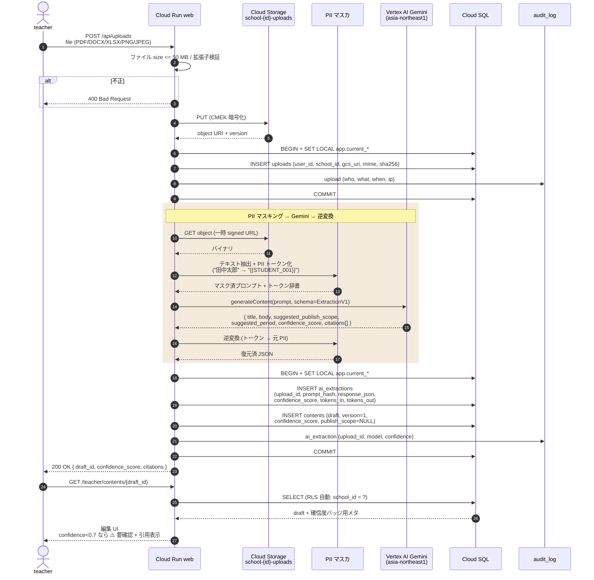

# シーケンス: 教員ファイル抽出 (F01)

- 状態: Draft (Part B — Refs #56, 親 #16)
- 最終更新: 2026-05-28
- 関連: [F01](../../requirements/functional/F01-teacher-file-extraction.md), [ADR-005](../../adr/), [ADR-017](../../adr/017-gemini-ai-structuring-with-confidence.md), [ADR-019](../../adr/019-rls-two-layer-tenant-isolation.md)

## 前提

- アップロードファイルは Cloud Storage `school-{school_id}-uploads/` バケットに CMEK 暗号化 + アクセスログ有効化で保存（[F01](../../requirements/functional/F01-teacher-file-extraction.md)）。
- AI 抽出は **Vertex AI Gemini (asia-northeast1)**（[ADR-005](../../adr/)）。
- LLM 送信前に PII を **トークン化**（生徒氏名・住所・電話・保護者名）→ 応答後に逆変換（[CLAUDE.md ルール 4](../../../CLAUDE.md)）。
- 認証 / RLS context は [auth-login.md](auth-login.md) 完了済前提。

## 登場ロール

| ロール | 役割 |
|---|---|
| `teacher` | 紙資料を PDF/Word/Excel/画像でアップロードする教員 |
| Cloud Run `web` | アップロード Route Handler + PII マスカ + Gemini クライアント |
| Cloud Storage | バケット `school-{id}-uploads/`（CMEK） |
| Vertex AI Gemini | 構造化抽出 |
| Cloud SQL | `uploads` / `ai_extractions` / `contents` / `audit_log` |

## シーケンス

## データ流れ

1. teacher が `web` にファイル POST。サイズ・拡張子を検証して Cloud Storage（CMEK）に保存。
2. `uploads` 行を `INSERT` + `audit_log` 記録。
3. テキスト抽出後、**PII をトークン化**してから Gemini に送信。
4. Gemini 応答（構造化 JSON + 引用 + confidence_score）を**逆変換**してから DB に保存。
5. `ai_extractions` に呼出を記録、`contents` に下書きを作成（`publish_scope=NULL`、公開は別フロー [instant-publish.md](instant-publish.md)）。
6. UI は `confidence_score < 0.7` の場合「⚠️ 要確認」バッジ + AI 引用根拠を表示（[F04.3](../../requirements/functional/F04-instant-publish-safety-nets.md)）。

## 監査ポイント

- **PII マスク必須**: Gemini 送信前にトークン化。マスク失敗時はリクエストを中断（[CLAUDE.md ルール 4](../../../CLAUDE.md)）。
- **AI 呼出の完全記録**: prompt_hash・応答・トークン数・confidence・model_version を `ai_extractions` に保存（[F01](../../requirements/functional/F01-teacher-file-extraction.md)）。
- **ファイル整合性**: アップロード時に SHA-256 を保存。改竄検知用に hash chain（`audit_log`）と相互参照。
- **テナント分離**: バケット名に `school_id` を含み、`SET LOCAL app.current_school_id` によって `uploads`・`ai_extractions`・`contents` 全テーブルが RLS で自校スコープ（[ADR-019](../../adr/019-rls-two-layer-tenant-isolation.md)）。
- **データ越境ゼロ**: Vertex AI は asia-northeast1 固定（[NFR07](../../requirements/non-functional/)）。

## 関連 ADR

- [ADR-005 Vertex AI](../../adr/)（region 固定）
- [ADR-017 Gemini AI 構造化 + confidence](../../adr/017-gemini-ai-structuring-with-confidence.md)
- [ADR-019 RLS 二層分離](../../adr/019-rls-two-layer-tenant-isolation.md)
- [ADR-015 即公開 + 安全網](../../adr/015-instant-publish-with-safety-nets.md)（後続フロー）
