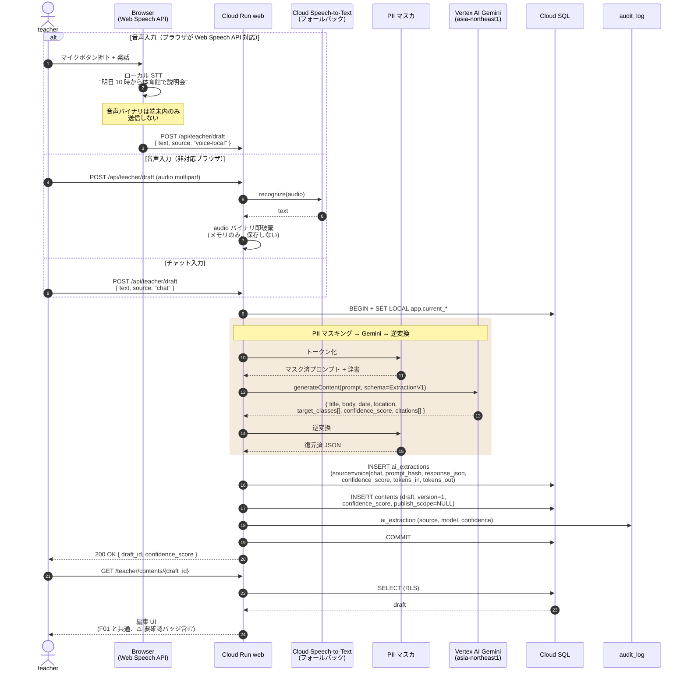

# シーケンス: 教員音声 / チャット入力 (F02)

- 状態: Draft (Part B — Refs #56, 親 #16)
- 最終更新: 2026-05-28
- 関連: [F02](../../requirements/functional/F02-teacher-voice-chat-input.md), [ADR-005](../../adr/), [ADR-006](../../adr/), [ADR-017](../../adr/017-gemini-ai-structuring-with-confidence.md)

## 前提

- 音声 → テキストは **Web Speech API**（教員端末ローカル処理）を第一選択、ブラウザ非対応時のみ **Cloud Speech-to-Text** にフォールバック（[F02](../../requirements/functional/F02-teacher-voice-chat-input.md)）。
- **音声バイナリは保存しない**（テキスト化後即破棄、PII 漏洩リスク低減）。
- AI 構造化は [F01](../../requirements/functional/F01-teacher-file-extraction.md) と同じ Gemini 経路を再利用、編集 UI も共通。
- 認証 / RLS context は [auth-login.md](auth-login.md) 完了済前提。

## 登場ロール

| ロール | 役割 |
|---|---|
| `teacher` | 音声 or チャット欄から入稿する教員 |
| Browser (Web Speech API) | 教員端末ローカルの STT |
| Cloud Run `web` | チャット Route Handler + PII マスカ + Gemini クライアント |
| Cloud Speech-to-Text | フォールバック STT |
| Vertex AI Gemini | 構造化抽出 |
| Cloud SQL | `ai_extractions` / `contents` / `audit_log` |

## シーケンス

## データ流れ

1. teacher が音声 or チャットで入稿。
2. 音声は **端末ローカル STT** が第一選択、非対応時のみサーバ側 Cloud STT にフォールバック。フォールバック時も音声バイナリは保存せずメモリのみで破棄。
3. テキスト化後、[F01](../../requirements/functional/F01-teacher-file-extraction.md) と同じ PII マスク → Gemini → 逆変換 → DB 保存経路に合流。
4. 編集 UI も F01 と共通（[teacher-file-extraction.md](teacher-file-extraction.md) 最後の SELECT と同経路）。
5. 公開は別フロー（[instant-publish.md](instant-publish.md)）。

## 監査ポイント

- **音声非保存**: Web Speech API パスでは音声がサーバに届かない。Cloud STT パスでも応答後即破棄（[F02](../../requirements/functional/F02-teacher-voice-chat-input.md)）。
- **入力ソースの記録**: `ai_extractions.source = 'voice-local' | 'voice-server' | 'chat'` で経路を識別可能に。
- **PII マスク**: テキスト化後の文字列に対して Gemini 送信前にトークン化（[CLAUDE.md ルール 4](../../../CLAUDE.md)）。
- **RLS**: `SET LOCAL` 経由で `ai_extractions` / `contents` を自校スコープに（[ADR-019](../../adr/019-rls-two-layer-tenant-isolation.md)）。
- **AI 呼出の完全記録**: F01 と同じ `ai_extractions` テーブルに保存（一元化）。

## 関連 ADR

- [ADR-005 Vertex AI](../../adr/)
- [ADR-006 Vercel AI SDK](../../adr/)（ストリーミング基盤、生徒 Q&A と共通）
- [ADR-017 Gemini AI 構造化 + confidence](../../adr/017-gemini-ai-structuring-with-confidence.md)
- [ADR-019 RLS 二層分離](../../adr/019-rls-two-layer-tenant-isolation.md)
